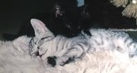
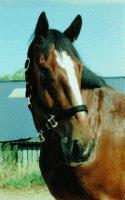
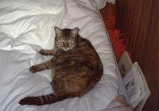
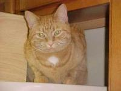
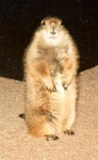
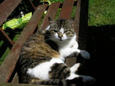

{::options parse_block_html="true" /}

FVWM would not have been possible without  the  tails,  ears  and  the
little  paws  of  the  coziest  beings  in  the world: our cats. Well,
perhaps we could have done without the paws. If your pet  ever  walked
straight  over  your  keyboard, chased your mouse pointer (yes, I know
cats are supposed to catch mice, but still...) or fell asleep on  your
trackball you know what I mean. ^_^ 

## Dominik's Cats

#### Kassandra
  
  __female, * 1989, + on 23rd of June in 2000 (bitten to death by a dog)__

  Kassandra was my favourite before I got Niniel, Luthien and Tilion. I had
  to leave her behind when I moved to Southern Germany. I loved her very much
  and I did not want to force her to move with me. We got them at the age of
  1 and a half years and it took three month before she came down from the
  heating pipes in our cellar.
  
#### Luthien
  
  __female, * 13th of September 1998, + run over by a car on 18th of March 1999)__

  Was the most beautiful kitten I've ever seen. She was my favourite cat the
  instant I saw her (she was hiding in the attic and hissed when I came too
  close). Had the strongest character and the largest eyes of the three. I
  miss her so much!

#### Niniel
  
  __(full name: Niniel Nienor), female, * 13th of September 1998, + passed away in peace on 20th of May 2011__

  The smallest and cutest of my three cats. A saucy little whirlwind that loves
  piddling on my bed and sofa. I have to find a better photograph.
  
#### Tilion
  
  __(male, * 13th of September 1998, ran away October 2002)__

  The biggest of my three cats. Hobbies: feeding and squawking. Once we tested
  when Tilion would stop feeding, but had to break off the experiment when
  we ran out of cat food.

#### Geoffrey and Pepper
  
  __male, * 1988, Pepper missing for years now (picture of Geoffrey below), Geoffrey
  was put to sleep on 26th of November 2001__

  Two big black tomcats with a few white patches on the belly. Most of the
  time when not feeding or sleeping they stray around the neighbourhood. Geoffrey
  was the terror of the cats in the area. I had to leave him behind when I
  moved to Althengstett.

#### Blacky and Tiger
  
  __female and male, * 1980, Tiger was given away when he was one and a half
  years old, Blacky was shot by a forest warden in 1987.__

  I can hardly remember those two. Tiger was given away because he slobbered
  in the lap of our visitors (we never forgave our parents). Have you seen his
  ears? Perhaps we had better called him 'Radar'. Blacky was a great hunter
  and the most undemanding cat we had. She suffered terribly when she was shot
  before the doctor put her to sleep.

* * *

## Dan's Cat

#### Angel
  

  Rescued from the front window of a deli, Angel leads an indoor cats life.
  To save our furniture Angel's front claws are removed. I believe, as a direct
  consequence, she's one of the most dangerous cats I've encountered. That's
  right, watch out for this cat, she bites, hard.

* * *

## Hippo's Cats

#### Corky
  

  Champion rat catcher. Proper name Corkscrew because he spent the first five
  minutes of his life going around in circles until he discovered that he had
  hind legs.

#### Scotty
  

  A Garfield fan. Originally named after Robert Falcon Scott the famous (if
  you're British) polar explorer as she was the first kitten to make it to
  the top the curtains and the only cat I know of to have gone up the inside
  of a pair of trousers hanging in a wardrobe. She has since lost the travel
  bug and spends her time testing the sofa for long term comfort.

#### Sir Boris II
  

  A strange looking cat with a taste for grass, carrots, bananas and blackcurrant
  juice.

* * *

## Bob's Cat

#### Tiny
  

  A playful lynx-point Siamese, she probably understands more about the FVWM
  code than I do by now.
  The only problem is getting her to stop typing while
  I'm trying to type. (Like I said, she's _playful._)
  One of these days, I'll try to get a picture of her in a debugging session,
  and a picture of her sister.

* * *

## Mikhael's Cats

#### Murzilka
  

  (short name: Murzya), a lovely kitty, from May 1999. When she was smaller,
  she loved to play with a mouse pointer and watch dynamic screensavers. Loves
  sleeping on the monitor with the tail falling onto the display. Can't bear
  washing.

#### Cassy
  

  (full name: Cassandra), from Oct 2000. Sometimes a full opposite to Murzilka,
  dominating, highly sociable, lap cat, fearless, loves to stay on two back
  legs and play non-stop with toys.

* * *

## Oliver's Cat

#### Lili
  

  A sweet and emotional cat, from September 1992. She does not like especially
  computers except when she wants her diner!
  She likes mouses but I have a touch pad ...

* * *

## Brad's Cat

#### Blaise
  

  You guessed it Blaise after Blaise Pascal, what else would you expect from
  a programmer, and a math loving wife. Blaise is in her usual spot waiting
  for dinner, she is good at telling time her clock is just an hour fast.

* * *

## Jason's "Cat"

#### Grendel
  

  OK, in this page he's more like "bait".  Grendel is a prairie dog, about
  18 months old in this picture.

* * *

## Alex's Cat

#### Bob
  

  My cat Bob is a very affectionate and totally loyal friend who's just had
  his 7th birthday. He eats too much, sleeps too much, and demands a lot of
  attention, often doing somersaults in my lap while I'm trying to work on
  my computer. I think he's jealous of it. Bob is fully trained and very obedient
  and does all sorts of tricks like "beg" and "roll over".

* * *

## Thomas' Cat

#### Mildred
  

  Mildred (DOB unknown - 2008) was originally a feral cat who we acquired 
  from a re-homing scheme, along with her brother George (anyone who's
  seen the sitcom George and Mildred will know the reference there),
  originally to keep the rat population down on the dairy farm.  But as with
  most feral cats, if they soon realize there's a source of food from other
  domestic cats, they tend not to go hunting too much.  So it was that Mildred
  in particular was soon domesticated.

  We had her ever since, even though we moved farms several times since we
  initially got her.  One of her amusing traits was that she was **always**
  meowing, to the extent that she'd talk to you all the time.  Say something
  -- anything to her -- and she'd meow back.  It was rather cute.

  She particularly took a liking to me and my step-father, and I won't ever
  know why -- I guess animals sometimes see something in a person that we
  do not.  But I miss her, and her overly sharp claws that she'd dig in to
  me from time to time.  Hmm, well, maybe I can try and forget the claws.  :)

* * *

## Jaimos' Cats

#### Butters
  

  Butters and Wendy are litter mates who were raised by a German Shepherd.
  Butters has grown to know no fear. His hobbies include wrestling with
  the shepherd, picking on Archimedes (another dog) and playing fetch. No
  loose hair tie is safe and any that are found will be nicely filed
  underneath the furniture. Butters favorite is paper. The sound of
  crinkling paper sends him running from any corner of the house to play
  fetch. When guest visit he entertains them all by making each one
  of them throw the ball of crumpled up paper.

  Butters not so desirable hobbies are getting attention when he is being
  ignored. He is fond of the art of sabotage by chewing though the wires
  beneath the desk. Butters has learned that removing the power to the
  router gets him all the attention he could ever want. And no matter
  what he does, Butters makes up for it be walking up just purrrfectly,
  flopping down on his side, knowing all is forgiven.

#### Wendy
  

  Wendy is sweet and mellow. She likes nothing more than a lap to curl up
  on. And work, work is overrated, you should just put down what you are
  doing and let me curl up on your lap. Doors should not be shut. Any shut
  door I will fight against by scratching it until it opens.

* * *

### What we love about our cats:
  + Their ears, tails and paws. And don't forget the whiskers.
  + Each one is a unique character.
  + Purring and cuddling.
  + Sleeping next to the keyboard.

### What we don't:
  + Piddling on the bed.
  + Screeching for food.
  + Sleeping _on_ the keyboard.

### Quotes and trivia:
  + "To err is human, To purr feline." -- Robert Byrne
  + "Cats are like people: the females are the prickly ones and the males
    are good-natured idiots."
  + "Will he ever stop feeding?"
  + "Ta-tadi, tatatatataaaa! Dies sind die Abenteuer des Raumschiffs Katerschweif."
    (Sorry, can't translate this to English.)
  + Did you know that cats sleep about 16 hours a day?
  + 54lopbg2qw^^^^^^^^^^^^^^^^^^^^^^^^^^^^^^^^^^^^^^^ "Tilion! Down from
    my keyboard, NOW!"
  + "Mrkgnaow!" - Tiny (who read a lot of James Joyce as an undergraduate)
  + "I hate cats!"
  + "Weehaa!" - Grendel

