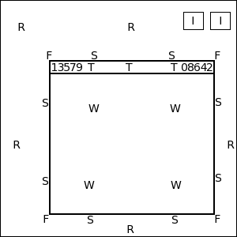

* TOC
{:toc}

Bindings
========

Bindings are actions/functions that can be triggered by hitting a key
(or key combination) or mouse buttons. These bindings can be used to
launch programs, run buit in functions (like Maximize or Iconify),
or even run custom functions. This how to configure FVWM to react to
key presses and mouse clicks.

## Basics

Whenever a key is pressed or a mouse is clicked Fvwm takes note of the
current location of the mouse. This is important because Fvwm needs to know
where the mouse was clicked, such as on the title bar or a paticular window
button. To understand how these work, lets first look how a typical screen
with one Window and two Iconified Windows is set up. As shown in the figure
below FVWM divides the screen up into the following regions.

  + __R__ = root window
  + I = Icon
  + F = frame corners
  + S = frame sides
  + T = titlebar
  + W = application window
  + 0-9 = window buttons
  + A = Anywhere

Any Fvwm command (including custom functions) can be triggered by a
binding. The configuration syntax for Key and Mouse bindings is
  

Key Name Context Modifier Command
Mouse Button Context Modifier Command


The Context describes the current location of the mouse (as shown above).
The Context can contain any number of possible locations such as
"TWF" will be either the Titlebar, Window or Frame corerns.

The Modifier is any additional key that is required to be pressed in addition
to the desired Key press or Mouse click (such as in Ctrl-Q the Ctrl key is
the modifier to the Q key). The valid Modifiers are:

  + __A__ = Any
  + __C__ = Control
  + __S__ = Shift
  + __M__ = Meta (Alt)
  + __N__ = None
  + __1-5__ = mod1-mod5 (man xmodmap)

Modifiers can be any combition of the valid modifiers to provide even more
control, for example the modifier 'CM' means that both the Ctrl and Meta
key must be pressed in addition to the binding. Below is a nice little
ASCII diagram you can put in config file to keep look this info up when
making bindings:


###########
# Contexts:
# R = Root Window             rrrrrrrrrrrrrrrrrrrrrr
# W = Application Window      rIrrrrFSSSSSSSSSFrrrrr
# F = Frame Corners           rrrrrrS13TTTT642Srrrrr
# S = Frame Sides             rIrrrrSwwwwwwwwwSrrrrr
# T = Title Bar               rrrrrrSwwwwwwwwwSrrrrr
# I = Icon                    rIrrrrFSSSSSSSSSFrrrrr
#                             rrrrrrrrrrrrrrrrrrrrrr
#
# Numbers are buttons: [1 3 5 7 9 T T T T T 0 8 6 4 2]
#
# Modifiers: (A)ny, (C)ontrol, (S)hift, (M)eta, (N)othing
#
# Key {(window)} [key] [Context] [Modifier] [Action]
# Mouse {(window)} [button] [Context] [Modifier] [Action]
####################


## Example Bindings

The following are some example key bindings:


# Keybindings
Key F1 A M Menu MenuFvwmRoot
Silent Key Menu A A Menu MenuFvwmRoot
Key Tab A M WindowList Root c c NoDeskSort, SelectOnRelease Meta_L
Key F1 A C GotoDesk 0 0
Key F2 A C GotoDesk 0 1
Key F3 A C GotoDesk 0 2
Key F4 A C GotoDesk 0 3
Silent Key Super_R A A Exec exec xterm


+ The fist binding opens the menu MenuFvwmRoot with Alt-F1.
+ The second binding opens the menu MenuFvwmRoot with the Menu key.
  Since not all keyboards have a Menu key, the Silent makes Fvwm
  produce no error if the Menu key is not found.
+ The third binding opens up a WindowList when Alt-Tab is hit to change windows.
+ The next group of four bindings swtich between desktops 0-3 with
  Ctrl-F1, Ctrl-F2, Ctrl-F3, or Ctrl-F4.
+ The last binding opens up an xterm if the Super_R (Windows) key is pressed.

Next is are some mouse bindings. Mouse bindings can be linkned with functions
to control what happens if you Click, Hold, Move, or Double Click.
So in these example bindings we make use of the following functions


# MoveClickX MoveCommand ClickCommand DoubleClickCommand
DestroyFunc MoveClickX
AddToFunc MoveClickX
+ M $0
+ C $1
+ D $2


This function is useful because now we can bind things to moves (M), clicks
(C) and double clicks (D) in the same Context (window button, title bar, etc).
Now the mouse bindings.


# Window Button Locations [13579 Title 08642]
Mouse 1 1 A Menu MenuWindowOps
Mouse 1 2 A MoveClickX Nop Close Destroy
Mouse 1 4 A Maximize 100 100
Mouse 2 4 A Maximize 0 100
Mouse 3 4 A Maximize 100 0
Mouse 1 6 A Iconify


+ Button 1 (far left) opens MenuWindowOps that can act on the window.
+ Button 2 (far right) is the close button. This use a custom function
  that will Close on a single click (ask the application to shut itself
  down) or Destroy on a double click (kill it).
+ Button 4 will Maximize the window. If clicked with mouse buton 1 (left)
  Maximize in both directions. If clicked with Mouse button 2 (the wheel)
  Maximze vertically. If clicked with Mouse button 3 (right) will Maximize
  horiztonally.
+ Button 6 Iconifies or mimizes the Window.

Next we also have to bind action for when grabing the title bar
to move a window or the window border to Resize it. Notice how
these bindings use different contextes for this.


# Windows Other
Mouse 1 T    A MoveClickX Move Raise Maximize
Mouse 1 FS   A MoveClickX Resize Raise Nop
Mouse 4 T    A MoveClickX Nop Raise "WindowShade True"
Mouse 5 T    A MoveClickX Nop Raise "WindowShade False"
Mouse 1 R    A Menu MenuFvwmRoot
Mouse 2 R    A WindowList
Mouse 3 R    A Menu MenuWindowOpsLong
Mouse 1 I    A MoveClickX Move Nop Iconify
Mouse 3 T    A Menu MenuWindowOps
Mouse 3 I    A Menu MenuIconOps


+ Clicking on the title bar allows you to move the window by holding
  the button and moving the mouse. Raises the window if you just click
  it once and Maximizes the window if you use a double click.
+ Clicking the window borders (frame sides and corners) allows
  one to resize or raise the window.
+ Rolling the mouse wheel up and down (mouse buttons 4 and 5)
  will WindowShade the window.
+ Clicking button 1 on the root window (desktop) will open up a menu.
+ Clicking button 2 on the root window will open up the WindowList.
+ Clicking button 3 on the root window will open up a WindowsOps menu.
+ Click on an icon to either Move and double click to DeIconify it.
+ Right clicking a title bar or an icon will open up a menu.

