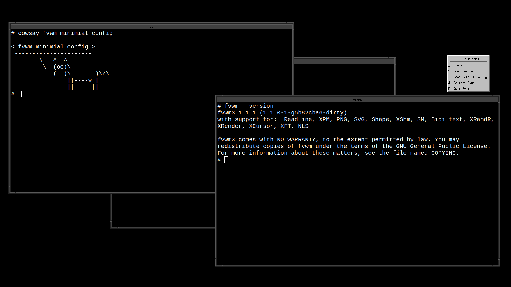

# Minimal Initial Configuration

Fvwm provides a very minimal set of internal defaults. As most things,
such as window decor, menus, key bindings, panels, all take memory and
resources. This way fvwm starts in a functional but very minimal state,
and allows your custom configuration to only add resources that you
actually want to use. To get an idea of what the minimal configuration
looks and feels like, you can either put a blank (empty) file in
`$HOME/.fvwm/config`, or you can run fvwm as follows:

```
fvwm -f /dev/null
```

Starting fvwm with a blank configuration file will give nothing
except a black screen and a mouse. If you click on the root window
a minimal menu is presented that can launch can basically launch
an xterm, or load the default config for you.

{:.m-3 .d-block .mx-auto .img-fluid}

From this very minimal state, all aspects of fvwm can be configured using
the [fvwm configuration file]({{ "/Config/Fvwm2rc" | prepend: site.wikiurl }}).
As an example check out the [default configuration file](
{{ "/DefaultConfig" | prepend: site.wikiurl }}) which covers all the
common configuration options. In contrast this shows how minimal or
full of features fvwm can be, with the default-config still be fairly
modest compared to some more complicated fvwm configurations.
