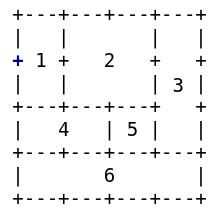

# Fvwm Modules

* TOC
{:toc}

The Modules are bits of software launched from within Fvwm using the `Module`
command to add more functionality and versatility to the Desktop. There are a handful
of different modules. The main ones are:

`FvwmIdent` to identify a window and gives information about it that can be useful
in configuring Fvwm. 
`FvwmScript` allows one to write custom desktop widgets and various other tools. 
`FvwmPager` shows a miniature view of the Desktops and Pages, and to switch desks
and pages. 
`FvwmIconMan` provides a grid of Icons (Buttons) that represent the running windows
on the system. 
`FvwmButtons` a powerful module that can be used to build custom panels and docks.

## Configuration

You need to configure a module and then launch it using the `Module` command. The modules
use `Colorsets` as an option, to be used throughout the module section.


# Module Colorsets
##################
#      10 - Module Default
#      11 - Module Hilight
#      12 - Module ActiveButton (Mouse Hover)
#      13 - FvwmPager Active Page
#      14 - FvwmIconMan Iconified Button
Colorset 10 fg #ffffff, bg #2b4e5e, hi #aaaaaa, sh #999999, Plain, NoShape
Colorset 11 fg #ffffff, bg #1a6e99, hi #ffffff, sh #ffffff, Plain, NoShape
Colorset 12 fg #2d2d2d, bg #ffffff, hi, sh, Plain, NoShape
Colorset 13 fg #ffffff, bg #006c6c, hi, sh, Plain, NoShape
Colorset 14 fg #a8988f, bg #2b4e5e, hi #aaaaaa, sh #999999, Plain, NoShape


To see how the basic syntax for module configuration works, let's take a look at the
`FvwmIdent` module. As with most things in Fvwm, the first thing that
should be done is to destroy any previous config. After that send some options to the
module as follows:


# FvwmIdent
###########
DestroyModuleConfig FvwmIdent: *
*FvwmIdent: Colorset 10
*FvwmIdent: Font "xft:Sans:Bold:size=12:antialias=True"


The config tells `FvwmIdent` what font and Colorset to use. To launch the module, add
`Module FvwmIdent` to an action.

Next, let's set up some `Styles` for FvwmPager. We want to set up the pager so it has
no window decorations and also so it won't include itself in the list of running tasks.
Also, make the pager `Sticky` so it will be shown on all your Virtual desktops and make
its size and position fixed. You can achieve this as follows:


#####
# FvwmPager
###########
Style "FvwmPager" NoTitle, !Handles, !Borders, Sticky, WindowListSkip, \
  CirculateSkip, StaysOnBottom, FixedPosition, FixedSize, !Iconifiable


Refer to the [FvwmPager](
{{ "/Modules/FvwmPager" | prepend: site.wikiurl }}) or man page for a full explanation
of all the options available. 

`FvwmButtons` is an incredible piece of software. It can create freeform panels of any
size, shape, colour and function. It can `Swallow` other applications, have `panels` that
slide out consisting of other panels, hundreds of possible bindings, and can even change
dynamically and respond to window manager events.

The basic layout of `FvwmButtons` is a rectangle. You set the geometry of the `FvwmButtons` by
giving its size (width X height) and then can break that into a grid by expressing the number of
rows and columns it has. Then inside each button, you can set up `Titles`, `Icons`, `Actions` and
even have it `Swallow` other applications. The buttons are filled in from the top left to the
bottom right as shown in the figure.


DestroyModuleConfig MyButtons: *
*MyButtons: Geometry 120x120+0+0
*MyButtons: Colorset 10
*MyButtons: Rows 4
*MyButtons: Columns 4
*MyButtons: Frame 1
*MyButtons: Font "xft:Sans:Bold:size=12:antialias=True"
*MyButtons: (1x2, Title "1", Icon /move.png, Action Move)
*MyButtons: (2x2, Title "2", Action(Mouse 1) 'Exec exec Calendar.sh')
*MyButtons: (1x3, Title "3")
*MyButtons: (2x1, Title "4")
*MyButtons: (1x1, Title "5", Action Resize)
*MyButtons: (4x1, Title "6", Swallow "xclock" 'Exec exec xclock')


The example is simple just to show you the basic syntax. A 4 rows and 4 columns button
with a title, a few action and launch buttons, and swallow Xclock.

Refer to the [FvwmButtons](
{{ "/Modules/FvwmButtons" | prepend: site.wikiurl }}) or man page for a full explanation
of all the options available. 
