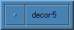
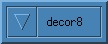
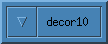
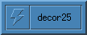
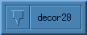

# Vector Buttons

* TOC
{:toc}

Vectors are a method to draw window buttons in Fvwm. A Vector definition
describes the button as a square. Position in the button is the X and Y
location as a percentage between 0 and 100 from the top left corner of the button.
The basic syntax of a Vector is


Vector Num XxY@Color XxY@Color ...


A Vector statement gives the number of points followed by a list
of that many points. Each point is listed as "XxY@Color" where X and Y
are the percent location and Color is a number given between 0 and 4
to set which color in the Colorset is used to draw the line
from the previous point. The valid numbers are

| Number | Color |
|--------|-------|
| 0 | Shadow |
| 1 | Hilight |
| 2 | Background |
| 3 | Foreground |
| 4 | Clear - Move |

For example to draw a line between the bottom left and top right corner use


Vector 2 0x100@1 100x0@3


Here the vector has 2 points, 0x100 (bottom left) and 100x0 (top right).
The first color @1 is ignored, and the second color @3 says the line is
drawn using the background color.

Draw a square inside the button using the hilight color for the top,
foreground color for the sides and shade color for the bottom:


Vector 5 20x20@4 80x20@1 80x80@3 20x80@0 20x20@3


One can additionally define an offset from a position in pixels
by including a +Xp or +Yp to the coordinates. An example of a vector
that draws a lightning bolt is


Vector 7 70-1px15-1p@0 30x55@1 50x55@0 40x85@1 80x45@0 60x45@1 70x15@0


Note the first point 70-1px15-1p describes a point offset one pixel from 70x15
in both directions.

Once you have a Vector button you want to use, you can add it to your
[/Config/Decor]({{ "/Config/Decor" | prepend: site.wikiurl }}) by the
use of ButtonStyle or AddButtonStyle:


ButtonStyle ButtonNumber ButtonState Vector Num XxY@Color XxY@color ...
AddButtonStyle ButtonNumber ButtonState Vector Num XxY@Color XxY@color ...


For example to add the lightning bolt example to button 1 for the active
windows use


ButtonStyle 1 Active Vector 7 70-1px15-1p@0 30x55@1 50x55@0 40x85@1 \
              80x45@0 60x45@1 70x15@0


Including 'Vector' in the above example is optional. Vector is the default
ButtonStyle used and not needed. I still like to include Vector it to remind
me this is a Vector definition.

## VectorButtons.js

Here is a simple Fvwm Vector Buttons Viewer written in
javascript by Alexander Gromnitsky. It can be useful
to help test vector buttons and get a better understanding of the
syntax.

<noscript>
Sorry guys, but this page works in
  JavaScript-enabled browser only.
</noscript>

<table>
<tr><td>
  
</td></tr>
</table>

## Examples

Here is a collection of example Vectors. Depending on the Colorset used,
the relief/3D look maybe have a different effect than the preview.

| Preview | Vector Definition |
|---------|-------------------|
||Vector 5 25x25@1 25x75@1 75x75@0 75x25@0 25x25@1|
||Vector 12 80x80@0 22x80@0 80x40@0 70x25@0 30x25@0 20x35@0 20x30@1 30x20@1 70x20@1 80x30@1 20x75@1 80x75@1|
||Vector 5 40x40@1 60x40@1 60x60@0 40x60@0 40x40@1|
||Vector 5 40x25@1 60x25@1 60x75@0 40x75@0 40x25@1|
||Vector 5 45x45@1 55x45@1 55x55@0 45x55@0 45x45@1|
||Vector 4 50x35@1 65x65@0 35x65@0 50x35@1|
||Vector 16 60x40@1 60x80@0 15x80@0 15x40@1 60x40@1 40x40@1 40x25@1 75x25@1 75x60@0 60x60@0 75x60@0 75x40@0 85x40@0 85x15@0 60x15@1 60x25@1|
||Vector 4 50x75@1 25x25@1 75x25@1 50x75@0|
||Vector 4 50x25@1 75x75@0 25x75@0 50x25@1|
||Vector 4 50x65@1 35x35@1 65x35@1 50x65@0|
||Vector 8 40x80@1 40x50@1 20x50@1 50x20@1 80x50@0 60x50@0 60x80@0 40x80@0|
||Vector 8 40x20@1 40x50@1 20x50@1 50x80@1 80x50@0 60x50@0 60x20@0 40x20@1|
||Vector 8 80x40@1 50x40@1 50x20@1 20x50@1 50x80@0 50x60@0 80x60@0 80x40@0|
||Vector 8 20x40@1 50x40@1 50x20@1 80x50@1 50x80@0 50x60@0 20x60@0 20x40@1|
||Vector 12 10x50@1 35x25@1 35x40@1 65x40@1 65x25@1 90x50@1 65x75@0 65x60@0 35x60@0 35x75@0 10x50@0 10x50@1|
||Vector 12 50x10@1 25x35@1 40x35@1 40x60@1 25x60@1 50x85@1 75x60@0 60x60@0 60x35@0 75x35@0 50x10@0 50x10@1|
||Vector 11 80x20@1 45x20@1 55x30@1 30x55@1 20x45@1 20x80@1 55x80@0 45x70@0 70x45@0 80x55@0 80x20@0|
||Vector 11 20x20@1 55x20@0 45x30@0 70x57@0 80x45@0 80x80@0 45x80@1 57x70@1 30x45@1 20x55@1 20x20@1|
||Vector 14 20x20@1 20x70@1 70x70@0 70x20@0 20x20@1 60x60@0 60x50@0 60x60@0 50x60@0 60x60@0 60x80@0 80x80@0 80x60@0 60x60@0|
||Vector 12 10x23@0 90x23@0 90x28@0 10x28@1 10x47@1 90x47@0 90x52@0 10x52@1 10x70@2 90x70@0 90x76@0 10x76@1|
||Vector 17 20x20@1 30x20@1 50x40@1 70x20@1 80x20@1 80x30@0 60x50@0 80x70@1 80x80@0 70x80@0 50x60@0 30x80@0 20x80@0 20x70@0 40x50@1 20x30@0 20x20@1|
||Vector 13 26x29@1 34x21@1 50x35@1 70x21@1 79x29@1 63x48@0 79x65@1 70x75@0 50x61@0 34x75@0 26x65@0 44x48@1 26x29@0|
||Vector 16 20x20@1 30x20@1 50x40@1 70x20@1 80x20@1 80x30@0 60x50@0 80x80@0 70x80@0 50x60@0 30x80@0 20x80@0 20x70@0 40x50@1 20x30@0 20x20@1|
||Vector 7 70x15@0 30x55@1 50x55@0 40x85@1 80x45@0 60x45@1 70x15@0|
||Vector 8 35x15@1 20x50@1 40x50@0 30x80@1 75x40@0 50x40@1 75x15@0 35x15@1|
||Vector 14 0x0@1 0x20@1 20x20@0 20x0@0 0x0@1 0x25@1 25x25@1 25x0@1 55x0@1 55x55@0 0x55@0 0x60@1 60x60@1 60x0@1|
||Vector 13 10x0@1 80x0@1 80x10@1 80x80@0 0x80@0 0x60@1 10x65@1 70x65@0 70x0@0 55x0@1 55x10@1 55x55@0 10x55@0|
||Vector 10 25x20@1 30x25@1 30x55@1 43x55@0 50x85@1 57x55@0 70x55@0 70x25@0 75x20@0 25x20@1|
||Vector 10 40x55@1 40x80@0 15x80@0 15x55@1 40x55@1 30x55@1 30x30@1 70x30@1 70x70@1 45x70@1|
||Vector 10 25x40@1 20x40@1 20x80@1 60x80@1 60x65@1 35x65@0 85x65@0 85x10@0 30x10@1 30x65@1|
||Vector 15 10x5@1 90x5@1 90x20@0 50x20@0 50x25@0 80x55@0 60x55@0 60x90@0 40x90@0 40x55@1 20x55@1 50x25@1 50x20@0 10x20@0 10x5@1 -- Flat|
||Vector 16 10x5@1 90x5@1 90x20@0 40x20@0 40x26@0 60x26@1 60x60@0 80x60@0 50x90@0 20x60@1 40x60@1 40x26@1 60x26@1 60x20@0 10x20@0 10x5@1 -- Flat|
||Vector 13 60x20@0 60x40@0 80x40@1 80x60@0 60x60@0 60x80@0 40x80@0 40x60@1 20x60@0 20x40@1 40x40@1 40x20@1 60x20@1 -- Flat|
||Vector 3 0+4px50+1p@0 100-5px50+1p@0 100-5px50-2p@0|
||Vector 3 0+4px100-5p@0 100-5px100-5p@0 100-5px0+4p@0|
||Vector 3 50-2px50+1p@0 50+1px50+1p@0 50+1px50-2p@0|
