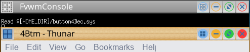

# 4Btm Decoration Example

This example will configure your window title bar to look like the following with 4 buttons
on the right side and one on the left side. The active window has a wood color image and
the inactive a gradient grey image.

||

This decor makes use of the MultiPixmap option to place transitional images between the button
locations and titles to get the above effect.

This decor requires a collection of images for the buttons you can [download here](decor-4btm.tar.gz).
This will be extracted into a directory called ‘4btm’. Put the directory in your ImagePath.
If unsure you can copy put the directory in $HOME/.fvwm.

To use this decor first configure the 
[Colorsets]({{ "/Config/Colorsets" | prepend: site.wikiurl }})


#   1 - Inactive Windows 
#   2 - Active Window
#   3 - Active Windows Borders
#   4 - Inactive Windows Borders
Colorset 1 fg #ffffff, bg #7194a6, hi, sh, Plain, NoShape
Colorset 2 fg #000000, bg #2b4e5e, hi, sh, Plain, NoShape
Colorset 3 fg #000000, bg #d5902f
Colorset 4 fg #ffffff, bg #000000


Next [Bind]({{ "/Config/Bindings" | prepend: site.wikiurl }})
actions to the window buttons. This decor uses
use locations 1, 8, 6, 4 and 2


# Window Button Locations [1 Title 8 6 4 2]
Mouse 1 2 A Close
Mouse 1 4 A Maximize
Mouse 1 6 A Iconify
Mouse 1 8 A QTile # Example for your function
Mouse 1 1 A Menu MenuWindowOps



Then define the Decor:


AddToDecor 4BTMDecor
+ TitleStyle Active MultiPixmap \
        Main     4btm/title-wood-active.png
+ TitleStyle Inactive MultiPixmap \
        Main     4btm/title-grey-inactive.png
+ ButtonStyle All -- UseTitleStyle
+ BorderStyle Simple -- HiddenHandles !NoInset Raised
+ TitleStyle LeftJustified -- Flat
+ ButtonStyle All -- Flat
+ AddButtonStyle 1 \
        ActiveUp   (Pixmap 4btm/options-active.png   -- flat) \
        Inactive   (Pixmap 4btm/options-inactive.png   -- flat)
+ AddButtonStyle 2 \
        ActiveUp   (Pixmap 4btm/close-active.png   -- flat) \
        Inactive   (Pixmap 4btm/close-inactive.png   -- flat)
+ AddButtonStyle 4 \
        ActiveUp   (Pixmap 4btm/maximize-active.png   -- flat) \
        Inactive   (Pixmap 4btm/maximize-inactive.png   -- flat)
+ AddButtonStyle 6 \
        ActiveUp   (Pixmap 4btm/iconify-active.png   -- flat) \
        Inactive   (Pixmap 4btm/iconify-inactive.png   -- flat)
+ AddButtonStyle 8 \
        ActiveUp   (Pixmap 4btm/tile-active.png   -- flat) \
        Inactive   (Pixmap 4btm/tile-inactive.png   -- flat)
+ ButtonStyle All - Clear
+ TitleStyle Height 26


Last we need the Styles for the windows to use 4BtmDecor, the
Colorsets, font size, and some other settings.


Style * Colorset 1, HilightColorset 2, \
        BorderColorset 4, HilightBorderColorset 3, \
        BorderWidth 2, HandleWidth 1, \
        FvwmBorder, FirmBorder, \
        MWMButtons, UseDecor 4BTMDecor
        
Style * Font "xft:Sans:size=12:minspace=False:antialias=True"


