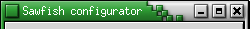

# Crux Decoration example

Often when new Window Managers pop up, among the first things the users and
developers do, is to create a familiar look mimicing other Window Managers.
And such is the intention of this example.

[Sawfish](http://sawmill.sf.net) was once a popular Window Manager used by
earlier versions of [Gnome](http://www.gnome.org). It includes a theme called
**Crux**. This example shows how to mimic the Crux-look using the Fvwm
features to streamline the look, and to minimize the use of external
image-files. As often is the case, other Window Managers cannot be mimiced
100%. In this case that includes the borders, and the inability to change
the colors in fly, to name a few.

Here are the active and incative windows of the original Sawfish Crux-theme.

| |

Looking at the above pictures, we can see that we will only be needing two
external image-files. One for the active window title, and one for inactive.
Those would be these:  and 

We'll begin by defining Colorsets using the knowledge from
ColorGradients.  To find out which colors to use,
one can use [Gimp](http://www.gimp.org) info-window to find out the exact
colors in hexadecimal format.


# InActive title right & text/bevel colors
Colorset 1 VGradient 32 4 grey96 30 grey90 50 grey88 85 grey76 10 black, \
    fg grey50, bg grey50, sh grey50, hi grey100
# Active title right & text/bevel color
Colorset 2 VGradient 32 4 grey96 30 grey85 50 grey80 80 grey60 10 black, \
    fg grey85, bg grey50, sh grey20, hi grey100
# Active title left. Note how you can use different ways to define colors.
# The most comfortable way would be using the colors listed in rgb.txt,
# but rgb:rr/gg/bb works just aswell.
Colorset 3 VGradient 32 3 #009a00 20 green4 50 darkslategrey 10 black, \
    bg grey
# InActive title left
Colorset 4 VGradient 32 3 grey80 80 grey70 70 grey62 10 black, \
    bg grey


Note: For recommended use of colorsets, see
[/Config/Colorsets]({{ "/Config/Colorsets" | prepend: site.wikibaseurl }}).

Next, we need to tell Fvwm to use those Colorsets for every window.


Style * Colorset 1, HilightColorset 2


The only images we need to use are 19 pixels high. Thus, we need to define
the desired titlebar height so that the images don't get streched. In
addition to the height, we need to get the title text justified to the left,
and tell Fvwm not to draw a 3D-bevel around the titlebar.


TitleStyle LeftJustified Height 19
TitleStyle -- Flat


Now comes the magic for the titlebar, the very powerful Multipixmap-option.
The syntax is: MultiPixmap section style arg

Possible sections include: Main, LeftMain, RightMain, UnderText, LeftOfText, RightOfText, LeftEnd, RightEnd, Buttons, LeftButtons, and RightButtons.

Possible styles include: Colorset, Solid, TiledPixmap, or AdjustedPixmap.


AddTitleStyle Active MultiPixmap \
    LeftMain Colorset 3, \
    RightMain Colorset 2, \
    UnderText Colorset 3, \
    RightOfText AdjustedPixmap crux-fvwm-ac.png

AddTitleStyle InActive MultiPixmap \
    LeftMain Colorset 4, \
    RightMain Colorset 1, \
    UnderText Colorset 4, \
    RightOfText AdjustedPixmap crux-fvwm-inac.png


Note: In the above code, Fvwm expects the .png files to be found from a directory defined in the ImagePath directive.

Lastly, we are going to add the buttons into the titlebar using the
knowledge from [/Config/Vectors]. On the last line we
instruct Fvwm to use the already-drawn titlebar gradient in the back, and
also to not draw a 3D-bevel around the buttons.


ButtonStyle All Vector 3 75x25@1 25x25@1 25x75@1
AddButtonStyle All Vector 5 20x20@0 20x80@0 80x80@0 80x20@0 20x20@0
AddButtonStyle All Vector 3 30x85@2 85x85@2 85x20@2
 
AddButtonStyle 2 Vector 2 40x40@0 60x60@0
AddButtonStyle 2 Vector 2 40x60@0 60x40@0
 
AddButtonStyle 4 Vector 5 35x35@0 35x65@0 65x65@0 65x35@0 35x35@0
AddButtonStyle 4 Vector 2 35x45@0 65x45@0
AddButtonStyle 4 Vector 2 35x40@0 65x40@0

AddButtonStyle 6 Vector 2 35x65@0 65x65@0
AddButtonStyle 6 Vector 2 35x60@0 65x60@0

ButtonStyle All -- UseTitleStyle Flat


To actually see the buttons, there needs to be some action bound to them.


Mouse 1 1 A WindowList
Mouse 1 2 A Close
Mouse 1 4 A Maximize
Mouse 1 6 A Iconify

