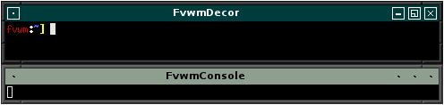

# Default Decoration

This is an example of using [Colorsets]({{ "/Config/Colorsets" | prepend: site.wikiurl }})
and [Vector Buttons]({{ "/Config/VectorButtons" | prepend: site.wikiurl }}). The borders
have a 3D beveled look, while the titlebar and buttons are Flat.

||

This is a Decor that doesn't require any images and can be done with
the effects built into Fvwm.

To use this decor first configure the 
[Colorsets]({{ "/Config/Colorsets" | prepend: site.wikiurl }})


#   1 - Inactive Windows 
#   2 - Active Window
#   3 - Inactive Windows Borders
#   4 - Active Windows Borders
Colorset 1  fg #000000, bg #8f9f8f
Colorset 2  fg #ffffff, bg #003c3c
Colorset 3  fg black, bg #4d4d4d, hi #676767, sh #303030
Colorset 4  fg black, bg #2d2d2d, hi #474747, sh #101010


Next we need to [Bind]({{ "/Config/Bindings" | prepend: site.wikiurl }})
actions to the window buttons (so they show up on the decor). This decor uses
uses buttons 1, 6, 4 and 2.


# Window Button Locations [1 Title 642]
Mouse 1 6 A Iconify
Mouse 1 4 A Maximize
Mouse 1 2 A Close
Mouse 1 1 A Menu MenuWindowOps


Then define the Decor:


AddToDecor   FvwmDecor
+ TitleStyle Centered Height 18 -- Flat

# Draw a Square around All buttons
+ ButtonStyle All ActiveUp Vector 5 15x15@4 15x85@3 85x85@3 \
              85x15@3 15x15@3 -- Flat
+ ButtonStyle All ToggledActiveUp Vector 5 15x15@4 15x85@3 \
              85x85@3 85x15@3 15x15@3 -- Flat
+ ButtonStyle All ActiveDown Vector 5 20x20@4 20x80@3 80x80@3 \
              80x20@3 20x20@3 -- Flat
+ ButtonStyle All ToggledActiveDown Vector 5 20x20@4 20x80@3 \
              80x80@3 80x20@3 20x20@3 -- Flat
+ ButtonStyle All ToggledInactive Vector 5 47x47@3 57x53@3 \
              53x53@3 53x47@3 47x47@3 -- Flat
+ ButtonStyle All Inactive Vector 5 47x47@3 57x53@3 53x53@3 \
              53x47@3 47x47@3 -- Flat

# Add the icon to each button
+ AddButtonStyle 1 Active Vector 5 45x45@3 55x45@3 55x55@3 \
                 45x55@3 45x45@3
+ AddButtonStyle 2 Active Vector 4 35x35@3 65x65@3 65x35@4 35x65@3
+ AddButtonStyle 4 Active Vector 8 30x70@3 30x30@3 70x30@3 70x70@3 \
                 30x70@3 30x50@4 50x50@3 50x70@3
+ AddButtonStyle 4 ToggledActiveUp Vector 8 30x70@3 30x30@3 70x30@3 \
                 70x70@3 30x70@3 50x30@4 50x50@3 70x50@3
+ AddButtonStyle 6 Active Vector 5 35x60@3 65x60@3 65x50@3 \
                 35x50@3 35x60@3
+ ButtonStyle All - Clear
+ ButtonStyle 1 - MwmDecorMenu
+ ButtonStyle 4 - MwmDecorMax
+ ButtonStyle 6 - MwmDecorMin


The above Decor first Draws a square around all buttons (with a smaller square
around pressed Down buttons). After that, AddButtonStyle adds the icon for each
button inside the square.

Last we need the Styles


Style * Colorset 1, HilightColorset 2, \
        BorderColorset 3, HilightBorderColorset 4, \
        BorderWidth 5, HandleWidth 5, \
        FvwmBorder, FirmBorder, \
        MWMButtons, UseDecor FvwmDecor


## Color Themes

This decor can be used with the color themes found [here](
{{ "/Config/Colorsets/#color-themes" | prepend: site.wikiurl }}). Follow
those instructions to create a menu that can change between the different
color themes.
