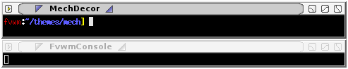

# Mech Decoration Example

Mech is a MultiPixmap decor that looks like

||

Download the images [here](decor-mech.tar.gz). This will extract into
a directory called 'mech'. Put the directory your ImagePath. If unsure
you can copy put the directory in $HOME/.fvwm.

To use this decor first configure the 
[Colorsets]({{ "/Config/Colorsets" | prepend: site.wikibaseurl }})


#   1 - Inactive Windows 
#   2 - Active Window
#   3 - Inactive Windows Borders
#   4 - Active Windows Borders
Colorset 1 fg #aaaaaa, bg #eeeeee
Colorset 2 fg #000000, bg #aaaaaa
Colorset 3 fg #aaaaaa, bg #d0d0d0
Colorset 4 fg #000000, bg #aaaaaa


Next we need to [Bind]({{ "/Config/Bindings" | prepend: site.wikibaseurl }})
actions to the window buttons (so they show up on the decor). This decor uses
use locations 1, 3, 5 and 8 6 4 2.


# Window Button Locations [1 Title 642]
Mouse 1 1 A Menu MenuWindowOps
Mouse 1 6 A Iconify
Mouse 1 4 A Maximize
Mouse 1 2 A Close


Now we can define the Decor:


DestroyDecor MechDecor
AddToDecor MechDecor
+ BorderStyle Simple -- HiddenHandles NoInset Raised
+ TitleStyle LeftJustified Height 18 
+ TitleStyle Active MultiPixmap \
        Main TiledPixmap mech/title-active.png, \
        LeftOfText AdjustedPixmap mech/titleleft-active.png, \
        RightOfText AdjustedPixmap mech/titleright-active.png, \
        LeftEnd AdjustedPixmap mech/titlefarleft-active.png, \
        RightEnd AdjustedPixmap mech/titlefarright-active.png
+ TitleStyle InActive MultiPixmap \
        Main TiledPixmap mech/title-inactive.png, \
        LeftOfText AdjustedPixmap mech/titleleft-inactive.png, \
        RightOfText AdjustedPixmap mech/titleright-inactive.png, \
        LeftEnd AdjustedPixmap mech/titlefarleft-inactive.png, \
        RightEnd AdjustedPixmap mech/titlefarright-inactive.png

+ ButtonStyle 1 \
        ActiveUp   (Pixmap mech/options-activeup.png) \
        ActiveDown (Pixmap mech/options-activedown.png) \
        Inactive   (Pixmap mech/options-inactive.png)
+ ButtonStyle 2 \
        ActiveUp   (Pixmap mech/close-activeup.png) \
        ActiveDown (Pixmap mech/close-activedown.png) \
        Inactive   (Pixmap mech/close-inactive.png)
+ ButtonStyle 4 \
        ActiveUp   (Pixmap mech/maximize-activeup.png) \
        ActiveDown (Pixmap mech/maximize-activedown.png) \
        Inactive   (Pixmap mech/maximize-inactive.png) \
        ToggledActiveUp   (Pixmap mech/maximize-activedown.png) \
        ToggledActiveDown (Pixmap mech/maximize-activeup.png) \
        ToggledInactive   (Pixmap mech/maximize-inactive.png)
+ ButtonStyle 6 \
        ActiveUp   (Pixmap mech/minimize-activeup.png) \
        ActiveDown (Pixmap mech/minimize-activedown.png) \
        Inactive   (Pixmap mech/minimize-inactive.png)

+ AddTitleStyle -- Flat
+ AddButtonStyle All -- UseTitleStyle Flat
+ ButtonStyle All - Clear
+ ButtonStyle 4 - MWMDecorMax
+ ButtonStyle 6 - MWMDecorMin
+ ButtonStyle 1 - MWMDecorMenu


Last we need the Styles for the windows to use this decor, the
Colorsets and some other settings.


Style * Colorset 1, HilightColorset 2, \
        BorderColorset 3, HilightBorderColorset 4, \
        BorderWidth 3, HandleWidth 3, \
        MWMBorder, FirmBorder, \
        MwmButtons, UseDecor MechDecor


