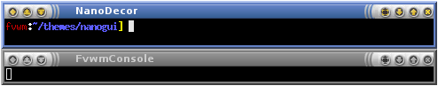

# NanoGui Decoration Example

NanoGui is a decor from fvwm-themes that use the MultiPixmap and
has a total of 7 buttons. This decor looks like

||

This decor requires multiple images. You need 3 versions of the image
for each button (Active, Inactive, Pressed) and images for the title bar.
Download the images [here](decor-nanogui.tar.gz). This will extract into
a directory called 'nanogui'. Put the directory your ImagePath. If unsure
you can copy put the directory in $HOME/.fvwm.

To use this decor first configure the 
[Colorsets]({{ "/Config/Colorsets" | prepend: site.wikibaseurl }})


#   1 - Inactive Windows 
#   2 - Active Window
#   3 - Inactive Windows Borders
#   4 - Active Windows Borders
Colorset 1 fg #cdcdcd, bg #7f7f7f
Colorset 2 fg #ffffff, bg #6381c6
Colorset 3 fg #cdcdcd, bg #7f7f7f
Colorset 4 fg #ffffff, bg #6381c6


Next we need to [Bind]({{ "/Config/Bindings" | prepend: site.wikibaseurl }})
actions to the window buttons (so they show up on the decor). This decor uses
use locations 1, 3, 5 and 8 6 4 2.


# Window Button Locations [135 Title 8642]
Mouse 1 1 A Menu MenuWindowOps
Mouse 1 3 A WindowShade True
Mouse 1 5 A WindowShade False
Mouse 1 8 A Stick
Mouse 1 6 A Iconify
Mouse 1 4 A Maximize
Mouse 1 2 A Close


Now we can define the Decor:


DestroyDecor NanoDecor
AddToDecor NanoDecor
+ BorderStyle Simple -- HiddenHandles NoInset Raised
+ TitleStyle LeftJustified Height 16 -- Flat
+ AddTitleStyle Active MultiPixmap \
    Main TiledPixmap nanogui/title-active.png, \
    LeftEnd AdjustedPixmap nanogui/titleleft-active.png, \
    RightEnd AdjustedPixmap nanogui/titleright-active.png, \
    Buttons TiledPixmap nanogui/under-buttons.png
+ AddTitleStyle Inactive MultiPixmap \
    Main TiledPixmap nanogui/title-inactive.png, \
    LeftEnd AdjustedPixmap nanogui/titleleft-inactive.png, \
    RightEnd AdjustedPixmap nanogui/titleright-inactive.png, \
    Buttons TiledPixmap nanogui/under-buttons-inactive.png

+ ButtonStyle All -- UseTitleStyle Flat

+ AddButtonStyle 1 \
    ActiveUp   (Pixmap nanogui/options-activeup.png) \
    ActiveDown (Pixmap nanogui/options-activedown.png) \
    Inactive   (Pixmap nanogui/options-inactive.png)
+ AddButtonStyle 2 \
    ActiveUp   (Pixmap nanogui/close-activeup.png) \
    ActiveDown (Pixmap nanogui/close-activedown.png) \
    Inactive   (Pixmap nanogui/close-inactive.png)
+ AddButtonStyle 4 \
    ActiveUp   (Pixmap nanogui/maximize-activeup.png) \
    ActiveDown (Pixmap nanogui/maximize-activedown.png) \
    Inactive   (Pixmap nanogui/maximize-inactive.png)
+ AddButtonStyle 6 \
    ActiveUp   (Pixmap nanogui/iconify-activeup.png) \
    ActiveDown (Pixmap nanogui/iconify-activedown.png) \
    Inactive   (Pixmap nanogui/iconify-inactive.png)
+ AddButtonStyle 8 \
    ActiveUp   (Pixmap nanogui/stick-activeup.png) \
    ActiveDown (Pixmap nanogui/stick-activedown.png) \
    Inactive   (Pixmap nanogui/stick-inactive.png)
+ AddButtonStyle 3 \
    ActiveUp   (Pixmap nanogui/shadeup-activeup.png) \
    ActiveDown (Pixmap nanogui/shadeup-activedown.png) \
    Inactive   (Pixmap nanogui/shadeup-inactive.png)
+ AddButtonStyle 5 \
    ActiveUp   (Pixmap nanogui/shadedown-activeup.png) \
    ActiveDown (Pixmap nanogui/shadedown-activedown.png) \
    Inactive   (Pixmap nanogui/shadedown-inactive.png)


Last we need the Styles for the windows to use this decor, the
Colorsets and some other settings.


Style * Colorset 1, HilightColorset 2, \
        BorderColorset 3, HilightBorderColorset 4, \
        BorderWidth 4, HandleWidth 4, \
        MWMBorder, FirmBorder, \
        MwmButtons, UseDecor NanoDecor


