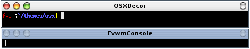

# OSX Decoration Example

This example will configure your windows to look like Mac OS-X

||

This decor requires multiple images. You need 3 versions of the image
for each button (Active, Inactive, Pressed) and images for the title bar.
Download the images [here](decor-osx.tar.gz). This will extract into
a directory called 'osx'. Put the directory your ImagePath. If unsure
you can copy put the directory in $HOME/.fvwm.

To use this decor first configure the 
[Colorsets]({{ "/Config/Colorsets" | prepend: site.wikibaseurl }})


#   1 - Inactive Windows 
#   2 - Active Window
#   3 - Inactive Windows Borders
#   4 - Active Windows Borders
Colorset 1 fg black, bg rgb:98/B0/C8
Colorset 2 fg black, bg white
Colorset 3 fg black, bg rgb:98/B0/C8
Colorset 4 fg black, bg rgb:98/B0/C8


Next we need to [Bind]({{ "/Config/Bindings" | prepend: site.wikibaseurl }})
actions to the window buttons (so they show up on the decor). This decor uses
use locations 1, 3, 5 and 2.


# Window Button Locations [135 Title 2]
Mouse 1 1 A Close
Mouse 1 3 A Iconify
Mouse 1 5 A Maximize
Mouse 1 2 A Menu MenuWindowOps


Now we can define the Decor:


DestroyDecor OSXDecor
AddToDecor OSXDecor
+ TitleStyle AllActive TiledPixmap osx/title-active.png
+ TitleStyle AllInactive TiledPixmap osx/title-inactive.png
+ ButtonStyle All Simple -- UseTitleStyle
+ BorderStyle Simple -- HiddenHandles NoInset
+ TitleStyle Centered Height 20 -- Flat
+ ButtonStyle All -- Flat
+ AddButtonStyle 1 \
        ActiveUp   (Pixmap osx/close-activeup.png   -- flat) \
        ActiveDown (Pixmap osx/close-activedown.png -- flat) \
        Inactive   (Pixmap osx/inactive.png   -- flat)
+ AddButtonStyle 2 \
        ActiveUp   (Pixmap osx/options-activeup.png   -- flat) \
        ActiveDown (Pixmap osx/options-activedown.png -- flat) \
        Inactive   (Pixmap osx/inactive.png   -- flat)
+ AddButtonStyle 3 \
        ActiveUp   (Pixmap osx/iconify-activeup.png   -- flat) \
        ActiveDown (Pixmap osx/iconify-activedown.png -- flat) \
        Inactive   (Pixmap osx/inactive.png   -- flat)
+ AddButtonStyle 5 \
        ActiveUp   (Pixmap osx/maximize-activeup.png   -- flat) \
        ActiveDown (Pixmap osx/maximize-activedown.png -- flat) \
        Inactive   (Pixmap osx/inactive.png   -- flat)
+ ButtonStyle All - Clear


Last we need the Styles for the windows to use OSXDecor, the
Colorsets and some other settings.


Style * Colorset 1, HilightColorset 2, \
        BorderColorset 3, HilightBorderColorset 4, \
        BorderWidth 2, HandleWidth 2, \
        FvwmBorder, FirmBorder, \
        FvwmButtons, UseDecor OSXDecor


