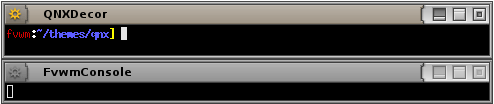

# QNX Decoration Example

This example will configure your windows to look like the following

||

This decor makes use of the MultiPixmap option to place transitional
images between the button locations and titles to get the above effect.

This decor requires a collection of images for the buttons you can
[download here](decor-qnx.tar.gz). This will extract into a directory
called ‘qnx’. Put the directory your ImagePath. If unsure you can copy
put the directory in $HOME/.fvwm.

To use this decor first configure the 
[Colorsets]({{ "/Config/Colorsets" | prepend: site.wikibaseurl }})


#   1 - Inactive Windows 
#   2 - Active Window
#   3 - Inactive Windows Borders
#   4 - Active Windows Borders
Colorset 1 fg rgb:00/00/00, bg rgb:80/80/80
Colorset 2 fg rgb:00/00/00, bg rgb:90/90/90
Colorset 3 fg rgb:00/00/00, bg rgb:80/80/80
Colorset 4 fg rgb:00/00/00, bg rgb:90/90/90


Next [Bind]({{ "/Config/Bindings" | prepend: site.wikibaseurl }})
actions to the window buttons. This decor uses
use locations 1, 6, 4 and 2


# Window Button Locations [1 Title 642]
Mouse 1 2 A Close
Mouse 1 4 A Maximize
Mouse 1 6 A Iconify
Mouse 1 1 A Menu MenuWindowOps


Then define the Decor:


AddToDecor QNXDecor
+ TitleStyle Active MultiPixmap \
        Main     qnx/title-main-active.png, \
        LeftEnd  qnx/title-leftend-active.png, \
        RightEnd qnx/title-rightend-active.png
+ TitleStyle Inactive MultiPixmap \
        Main     qnx/title-main-inactive.png, \
        LeftEnd  qnx/title-leftend-inactive.png, \
        RightEnd qnx/title-rightend-inactive.png
+ ButtonStyle All -- UseTitleStyle
+ BorderStyle Simple -- HiddenHandles !NoInset Raised
+ TitleStyle LeftJustified -- Flat
+ ButtonStyle All -- Flat
+ AddButtonStyle 1 \
        ActiveUp   (Pixmap qnx/options-activeup.png   -- flat) \
        ActiveDown (Pixmap qnx/options-activedown.png -- flat) \
        Inactive   (Pixmap qnx/options-inactive.png   -- flat)
+ AddButtonStyle 2 \
        ActiveUp   (Pixmap qnx/close-activeup.png   -- flat) \
        ActiveDown (Pixmap qnx/close-activedown.png -- flat) \
        Inactive   (Pixmap qnx/close-inactive.png   -- flat)
+ AddButtonStyle 4 \
        ActiveUp   (Pixmap qnx/maximize-activeup.png   -- flat) \
        ActiveDown (Pixmap qnx/maximize-activedown.png -- flat) \
        Inactive   (Pixmap qnx/maximize-inactive.png   -- flat)
+ AddButtonStyle 6 \
        ActiveUp   (Pixmap qnx/iconify-activeup.png   -- flat) \
        ActiveDown (Pixmap qnx/iconify-activedown.png -- flat) \
        Inactive   (Pixmap qnx/iconify-inactive.png   -- flat)
+ AddButtonStyle 4 \
        ToggledActiveUp   (Pixmap qnx/maximize-activedown.png -- flat) \
        ToggledActiveDown (Pixmap qnx/maximize-activeup.png   -- flat) \
        ToggledInactive   (Pixmap qnx/maximize-inactive.png   -- flat)
+ ButtonStyle All - Clear
+ TitleStyle Height 20


Last we need the Styles for the windows to use QNXDecor, the
Colorsets and some other settings.


Style * Colorset 1, HilightColorset 2, \
        BorderColorset 3, HilightBorderColorset 4, \
        BorderWidth 4, HandleWidth 4, \
        FvwmBorder, FirmBorder, \
        MWMButtons, UseDecor QNXDecor


