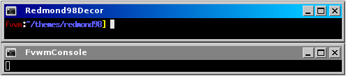

# Redmond98 Decoration Example

This example will configure your windows to look like Windows 98.

||

One thing to notice about this Decor is Button 1 (far left) uses
the MiniIcon of the application. For example, Firefox would use its
icon on its windows. Additionally you can set the MiniIcon using
Styles. Put the image, img.png, in your ImagePath and then set the
MiniIcon with


Style AppClass MiniIcon "img.png"


This decor requires a collection of images for the buttons you can
[download here](decor-redmond98.tar.gz). This will extract into a directory
called ‘redmondxp’. Put the directory your ImagePath. If unsure you can copy
put the directory in $HOME/.fvwm.

To use this decor first configure the 
[Colorsets]({{ "/Config/Colorsets" | prepend: site.wikiurl }})


#   1 - Inactive Windows 
#   2 - Active Window
#   3 - Inactive Windows Borders
#   4 - Active Windows Borders
Colorset 1 fg white, bg grey51
Colorset 2 fg white, bg Blue3, hi #40B0F0
Colorset 3 fg white, bg #c3c3c3
Colorset 4 fg white, bg #c3c3c3


Next [Bind]({{ "/Config/Bindings" | prepend: site.wikiurl }})
actions to the window buttons. This decor uses
use locations 1, 6, 4 and 2


# Window Button Locations [1 Title 642]
Mouse 1 2 A Close
Mouse 1 4 A Maximize
Mouse 1 6 A Iconify
Mouse 1 1 A Menu MenuWindowOps


Then define the Decor:


AddToDecor Redmond98Decor
+ TitleStyle AllInactive Solid grey51
+ TitleStyle Active      HGradient 128 Blue4 DeepSkyBlue
+ ButtonStyle All Simple -- UseTitleStyle
+ AddButtonStyle All   AllInactive Solid grey51
+ AddButtonStyle Left  AllActive   Solid Blue4
+ AddButtonStyle Right AllActive   Solid DeepSkyBlue
+ BorderStyle Simple -- HiddenHandles NoInset Raised
+ TitleStyle      LeftJustified
+ TitleStyle      -- Flat
+ ButtonStyle     All -- Flat
+ AddButtonStyle 1 MiniIcon
+ AddButtonStyle 2 ActiveUp   Pixmap redmond98/win-window-close.png
+ AddButtonStyle 2 ActiveDown Pixmap redmond98/win-window-close-pressed.png
+ AddButtonStyle 2 Inactive   Pixmap redmond98/win-window-close.png
+ AddButtonStyle 4 ActiveUp   Pixmap redmond98/win-window-maximize.png
+ AddButtonStyle 4 ActiveDown Pixmap redmond98/win-window-maximize-pressed.png
+ AddButtonStyle 4 Inactive   Pixmap redmond98/win-window-maximize.png
+ AddButtonStyle 6 ActiveUp   Pixmap redmond98/win-window-iconify.png -- Right flat
+ AddButtonStyle 6 ActiveDown Pixmap redmond98/win-window-iconify-pressed.png -- Right flat
+ AddButtonStyle 6 Inactive   Pixmap redmond98/win-window-iconify.png -- Right flat
+ AddButtonStyle 4 ToggledActiveUp   Pixmap redmond98/win-window-restore.png
+ AddButtonStyle 4 ToggledActiveDown Pixmap redmond98/win-window-restore-pressed.png
+ AddButtonStyle 4 ToggledInactive   Pixmap redmond98/win-window-restore.png
+ ButtonStyle All - Clear
+ ButtonStyle 1 - MwmDecorMenu
+ ButtonStyle 6 - MwmDecorMin
+ ButtonStyle 4 - MwmDecorMax
+ TitleStyle Height 20


Last we need the Styles for the windows to use this decor, the
Colorsets and some other settings.


Style * Colorset 1, HilightColorset 2, \
        BorderColorset 3, HilightBorderColorset 4, \
        BorderWidth 5, HandleWidth 5, \
        FvwmBorder, FirmBorder, \
        MWMButtons, UseDecor Redmond98Decor


