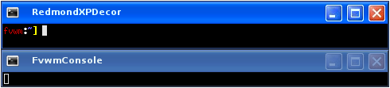

# RedmondXP Decoration Example

This example will configure your windows to look like Windows XP.

||

One thing to notice about this Decor is Button 1 (far left) uses
the MiniIcon of the application. For example, Firefox would use its
icon on its windows. Additionally you can set the MiniIcon using
Styles. Put the image, img.png, in your ImagePath and then set the
MiniIcon with


Style AppClass MiniIcon "img.png"


This decor requires a collection of images for the buttons you can
[download here](decor-redmondxp.tar.gz). This will extract into a directory
called ‘redmondxp’. Put the directory your ImagePath. If unsure you can copy
put the directory in $HOME/.fvwm.

To use this decor first configure the
[Colorsets]({{ "/Config/Colorsets" | prepend: site.wikiurl }})


#   1 - Inactive Windows
#   2 - Active Window
#   3 - Inactive Windows Borders
#   4 - Active Windows Borders
Colorset 1 fg rgb:e8/f5/f5, bg rgb:3d/60/90, fgsh rgb:22/48/7a
Colorset 2 fg rgb:df/ff/ff, bg rgb:03/56/cc, fgsh rgb:22/48/7a
Colorset 3 bg rgb:45/61/9e, sh rgb:4a/5e/7d, hi rgb:4c/6f/af
Colorset 4 bg rgb:07/49/de, sh rgb:25/56/a3, hi rgb:06/5b/f6


Next [Bind]({{ "/Config/Bindings" | prepend: site.wikiurl }})
actions to the window buttons. This decor uses
use locations 1, 6, 4 and 2


# Window Button Locations [1 Title 642]
Mouse 1 2 A Close
Mouse 1 4 A Maximize
Mouse 1 6 A Iconify
Mouse 1 1 A Menu MenuWindowOps


Then define the Decor:


AddToDecor RedmondXPDecor
+ TitleStyle AllActive   TiledPixmap redmondxp/title-active.png
+ TitleStyle AllInactive TiledPixmap redmondxp/title-inactive.png
+ ButtonStyle All Simple -- UseTitleStyle
+ BorderStyle   Simple -- HiddenHandles NoInset Raised
+ TitleStyle    LeftJustified -- Flat
+ ButtonStyle   All -- Flat
+ AddButtonStyle 1 MiniIcon
+ AddButtonStyle 2 ActiveUp   Pixmap redmondxp/close-activeup.png
+ AddButtonStyle 2 ActiveDown Pixmap redmondxp/close-activedown.png
+ AddButtonStyle 2 Inactive   Pixmap redmondxp/close-inactive.png
+ AddButtonStyle 4 ActiveUp   Pixmap redmondxp/maximize-activeup.png
+ AddButtonStyle 4 ActiveDown Pixmap redmondxp/maximize-activedown.png
+ AddButtonStyle 4 Inactive   Pixmap redmondxp/maximize-inactive.png
+ AddButtonStyle 6 ActiveUp   Pixmap redmondxp/iconify-activeup.png
+ AddButtonStyle 6 ActiveDown Pixmap redmondxp/iconify-activedown.png
+ AddButtonStyle 6 Inactive   Pixmap redmondxp/iconify-inactive.png
+ AddButtonStyle 4 ToggledActiveUp   Pixmap redmondxp/unmaximize-activeup.png
+ AddButtonStyle 4 ToggledActiveDown Pixmap redmondxp/unmaximize-activedown.png
+ AddButtonStyle 4 ToggledInactive   Pixmap redmondxp/unmaximize-inactive.png
+ ButtonStyle All - Clear
+ ButtonStyle 1 - MwmDecorMenu
+ ButtonStyle 6 - MwmDecorMin
+ ButtonStyle 4 - MwmDecorMax
+ TitleStyle Height 27


Last we need the Styles for the windows to use RedmondXPDecor, the
Colorsets and some other settings.


Style * Colorset 1, HilightColorset 2, \
        BorderColorset 3, HilightBorderColorset 4, \
        BorderWidth 2, HandleWidth 2, \
        FvwmBorder, FirmBorder, \
        MWMButtons, UseDecor RedmondXPDecor


