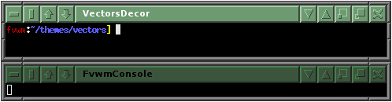

# Vectors Decoration Example

This is an example of using [Colorsets]({{ "/Config/Colorsets" | prepend: site.wikibaseurl }})
and [Vector Buttons]({{ "/Config/VectorButtons" | prepend: site.wikibaseurl }}) with the
3D Raised/Sunk look. 

||

This is a Decor that doesn't require any images and can be done with
the effects built into Fvwm.

To use this decor first configure the 
[Colorsets]({{ "/Config/Colorsets" | prepend: site.wikibaseurl }})


#   1 - Inactive Windows 
#   2 - Active Window
#   3 - Inactive Windows Borders
#   4 - Active Windows Borders
Colorset 1 fg black, bg #3B553D
Colorset 2 fg white, bg rgb:6e/9a/71
Colorset 3 fg black, bg grey40
Colorset 4 fg white, bg grey40


Next we need to [Bind]({{ "/Config/Bindings" | prepend: site.wikibaseurl }})
actions to the window buttons (so they show up on the decor). This decor uses
uses lots of buttons.


# Window Button Locations [1357 Title 08642]
Mouse 1 4 A Iconify
Mouse 1 2 A Maximize
Mouse 1 1 A Menu MenuWindowOps
...


Then define the Decor:


AddToDecor VectorsDecor
+ BorderStyle Simple
+ TitleStyle LeftJustified Height 22 -- Raised
+ ButtonStyle All -- Raised

+ ButtonStyle 1 Vector 5 25x40@1 25x60@1 75x60@0 75x40@0 25x40@1
+ ButtonStyle 2 Vector 17 25x25@1 35x25@1 50x40@1 65x25@1 75x25@1 \
                75x35@0 60x50@0 75x65@1 75x75@0 65x75@0 50x60@0 \
                35x75@0 25x75@0 25x65@0 40x50@1 25x35@0 25x25@1
+ ButtonStyle 4 Vector 12 40x60@1 40x75@1 20x75@1 20x50@1 35x50@1 \
                35x50@1 35x20@1 75x20@1 75x60@0 35x60@0 35x55@0 35x50@1
+ ButtonStyle 6 Vector 10 40x50@1 40x75@0 20x75@0 20x50@1 40x50@1 \
                30x50@1 30x20@1 70x20@1 70x60@1 45x60@1
+ ButtonStyle 8 Vector 4 50x25@1 75x75@0 25x75@0 50x25@1
+ ButtonStyle 0 Vector 4 50x75@1 25x25@1 75x25@1 50x75@0
+ ButtonStyle 3 Vector 5 40x25@1 60x25@1 60x75@0 40x75@0 40x25@1
+ ButtonStyle 5 Vector  8 40x75@1 40x50@1 25x50@1 50x25@1 75x50@0 \
                60x50@0 60x75@0 40x75@0
+ ButtonStyle 7 Vector  8 40x25@1 40x50@1 25x50@1 50x75@1 75x50@0 \
                60x50@0 60x25@0 40x25@0


Last we need the Styles


Style * Colorset 1, HilightColorset 2, \
        BorderColorset 3, HilightBorderColorset 4, \
        BorderWidth 5, HandleWidth 6, \
        FvwmBorder, FirmBorder, \
        MWMButtons, UseDecor VectorDecor


## Color Themes

This Decor was adopted from fvwm-themes which contained many color themes
that went with it. These themes can be found [here](
{{ "/Config/Colorsets/#color-themes" | prepend: site.wikibaseurl }}). Follow
those instructions to create a menu that can change between the different
color themes.
