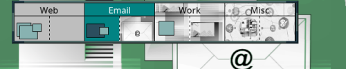

# FvwmBacker

* TOC
{:toc}

The FvwmBacker module provides functionality to change the background when
changing  desktops. Any command can be executed to change the backgrounds.
Actually, any arbitrary command can be sent to fvwm to execute, so you
could also do things such as changing window border colors, etc.

Between the desktops you can personalize them by giving them individual
background colors.


*FvwmBacker: Command (Desk 0) -solid white
*FvwmBacker: Command (Desk 2) Colorset 5


Instead of colors, you can define background images. This example, `fvwm-root`
only supports .xpm, .png, and .svg. A tool like `feh` would support more image
formats and allow you to set wallpapers per monitor (which fvwm-root cannot do).


*FvwmBacker: Command (Desk 0) Exec exec fvwm-root $[HOME]/background-mono.png
*FvwmBacker: Command (Desk 2) Exec exec fvwm-root $[HOME]/wallpaper-nature.png


Also to change the background for each page:


*FvwmBacker: Command (Desk 1, Page 0 0) -solid green
*FvwmBacker: Command (Desk 1, Page 1 0) Colorset 10


The changes will not be implemented until you instruct Fvwm to update the screens
during the initialization:


AddToFunc StartFunction I Module FvwmBacker


## Example

You can set each desktop screen (or page) with a different background. This
advanced example changes your Desktop with 4 desks and FvwmPager miniature
views with different images. 1st desk with grey color.

{:.d-block .mx-auto .img-fluid}

For FvwmPager configuration, refer to the
[FvwmPager]({{ "/Modules/FvwmPager" | prepend: site.wikiurl }}) page. Images
for the miniature views you configure `Colorsets` with the option `Pixmap`.


Colorset 22 #92a8d5
Colorset 23 Pixmap $[FVWM_USERDIR]/images/email-thumb.png
Colorset 24 Pixmap $[FVWM_USERDIR]/images/work-thumb.png
Colorset 25 Pixmap $[FVWM_USERDIR]/images/misc-thumb.png
Colorset 30 fg #ffffff, bg #028383


**FvwmPager**

DesktopSize "2 1"

DesktopName 0 Web
DesktopName 1 Email
DesktopName 2 Work
DesktopName 3 Misc

DestroyModuleConfig FvwmPager: *
*FvwmPager: HilightColorset * 30
*FvwmPager: Rows 1
*FvwmPager: Colorset 0 22
*FvwmPager: Colorset 1 23
*FvwmPager: Colorset 2 24
*FvwmPager: Colorset 3 25

AddToFunc StartFunction I Module FvwmPager 0 3


**FvwmBacker**


DestroyModuleConfig FvwmBacker: *
*FvwmBacker: Command (Desk 0, Page 0 0) Exec exec fvwm-root $[FVWM_USERDIR]/images/web.png
*FvwmBacker: Command (Desk 0, Page 1 0) Exec exec fvwm-root $[FVWM_USERDIR]/images/media.png

*FvwmBacker: Command (Desk 1) Exec exec fvwm-root $[FVWM_USERDIR]/images/email.png
*FvwmBacker: Command (Desk 2) Exec exec fvwm-root $[FVWM_USERDIR]/images/work.png
*FvwmBacker: Command (Desk 3) Exec exec fvwm-root $[FVWM_USERDIR]/images/misc.png

AddToFunc StartFunction I Module FvwmBacker

