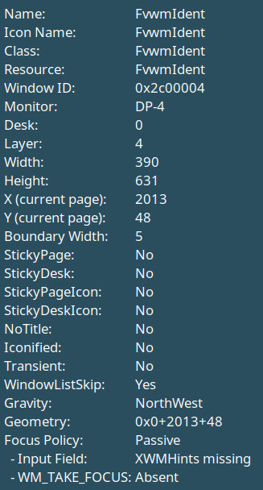

# FvwmIdent

To launch FvwmIdent, you need to issue the following `Module` command
to fvwm via a menu item, key binding, and so on.


Module FvwmIdent


Once run, use the mouse to select a window and a new window will open
containing information about the window that can be useful when configuring
or debugging fvwm. The class or resource of a window can be used to help
better know what names to use when applying `Styles` to the window. It also
contains other information such as its window id, current size and location,
current state, which layer it is on, and so forth. Below is a screen shot
of using FvwmIdent to identify FvwmIdent, to show what information to expect.

{:.d-block .mx-auto .img-fluid}

FvwmIdent can either be used as above, where you click on which window to
identify, or used in a window context menu that can will identify the
associated window without having to click on it. For example, the default
configuration binds to a menu to the windows listed in the [FvwmIconMan](
{{ "/Modules/FvwmIconMan" | prepend: site.wikiurl }}) that opens with
a right click. Selecting identify from that menu will run FvwmIdent on
the associated window. You can also identify windows using conditional
commands. For example to identify the next xterm, use:


Next (xterm) Module FvwmIdent

