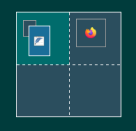
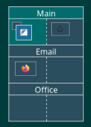

# FvwmPager

* TOC
{:toc}

The FvwmPager module shows a miniature view of the Fvwm desktops which are
specified in the command line. This is a useful reminder of where your
active windows are. Windows in the pager are shown in the same color as
their fvwm decorations.  The pager can be used to change your viewport into
the current desktop, to change desktops, or to move windows around.

## Configuration and Use

FvwmPager is used to show the layout of your desktop. It will show all the Pages
and Desktops you have set up, and the windows opened in each.

A single fvwm Desktop is split up into a grid of pages. The number of pages is
configured with the DesktopSize command. For the FvwmPager configuration, refer
to the man page for a full explanation of all the options available. This
configuration is the same as in fvwm default config.

{: style="float: right; margin-right: 5em; margin-top: 1em;"}



DesktopSize 2x2

DestroyModuleConfig FvwmPager: *
*FvwmPager: Geometry 150x150-0+0
*FvwmPager: Font None
*FvwmPager: Colorset * 10
*FvwmPager: HilightColorset * 13
*FvwmPager: BalloonColorset * 10
*FvwmPager: WindowColorsets 10 11
*FvwmPager: Balloons All
*FvwmPager: BalloonFont "xft:Sans:Bold:size=8:antialias=True"
*FvwmPager: BallonYOffset +2
*FvwmPager: Window3dBorders
*FvwmPager: MiniIcons"
*FvwmPager: UseSkipList

{{ txt }}


Next is to set up the Styles and Colorsets you want to use for your pager.


Style "FvwmPager" NoTitle, !Handles, !Borders, Sticky, WindowListSkip, \
 CirculateSkip, StaysOnBottom, FixedPosition, FixedSize, !Iconifiable


To launch the FvwmPager, you run it as <strong>Module FvwmPager * </strong>

## Example

Fvwm supports multiple Desktops. The default desktop is 0 and there is no set cap
on the number of desktops you can use. Also, Desktops can be given names.

In this advanced example, you can add and edit the above configuration. The
screenshot shows FvwmPager with multiple Desktops by DesktopName commands. This
helps to keep things organized. The following added configuration demonstrates this :

{: style="float: right; margin-right: 5em; margin-top: 0.2em;"}



DesktopName 0 Web
DesktopName 1 Email
DesktopName 2 Office

DesktopSize 2x1  ## (columns x rows)
Module FvwmPager 0 2 ## (desk 0 - number of desks)

*FvwmPager: Geometry 150x230-0+0
*FvwmPager: Font "xft:Sans:size=12:antialias=True"
*FvwmPager: Rows 3

{{ txt }}

