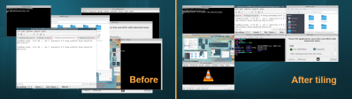

# FvwmRearrange

* TOC
{:toc}

This module can be called to tile or cascade windows.

When tiling the module attempts to tile windows on the current
screen subject to certain constraints. Horizontal or vertical tiling
is performed so that each window does not overlap another,
and by default each window is resized to its nearest
resize increment (note sometimes some space might appear between
tiled windows -- this is why).

When cascading the module attempts to cascade windows on the
current screen subject to certain constraints. Layering is performed
so consecutive windows will have their window titles visible underneath
the previous.

## Configuration and Use

FvwmRearrange is invoked from a menu, pop-up, or button. Several
command line options can be used to constrain the layering. For a full
list of FvwmRearrange configuration options see the FvwmRearrange manpage.

Here is a sample configuration for tiling with 2 columns.


FvwmRearrange -tile -r -mn 2 -maximize 0 0


To restore the windows, FvwmRearrange doesn't reverse the options,
use this for all.


All (CurrentPage, !Iconic, CirculateHit, !Sticky) Maximize Off


## Example

This advanced example is attached to key binding (alt-t) with functions that
do the tiling with 3 columns. With the same key binding, it restores all
windows. The below screenshot, before and after tiling, and the following configuration demonstrates this :

||

Tiling with 3 columns.


DestroyFunc 3Tile
AddToFunc 3Tile
+ I FvwmRearrange -tile -r -mn 3 -maximize 1 3 92 92


Tile switch on and off.


InfoStoreAdd TileSwitch "ON"

DestroyFunc Tile
AddToFunc Tile
+ I Test (EnvMatch infostore.TileSwitch ON) TileOn
+ I TestRc (NoMatch) TileOff

DestroyFunc TileOn
AddToFunc TileOn
+ I 3Tile
+ I InfoStoreAdd TileSwitch OFF

DestroyFunc TileOff
AddToFunc TileOff
+ I All (CurrentPage, !Iconic, CirculateHit, !Sticky) Maximize Off
+ I InfoStoreAdd TileSwitch ON


Key binding (alt-t)


Key t A M Tile

