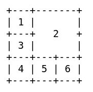

# Container

* TOC
{:toc}

This example, I call "Key Panel" because the `Container's` unique options can
be formed into any pattern, size and number of buttons. `FvwmButtons` to control
many of my functions and application selection in one place.

## Actions

`Containers` are defined spaces that span multiple `rows` and `columns` or
subdivide a row or column into more rows or columns. This can be useful for
instance if one wants to allocate a certain space to elements. Say one wants
to `swallow` an Xclock and Xosview. This can be defined as such:


*FvwmButtons: (Container(Rows 2, Columns 1)
*FvwmButtons: (1x1, Swallow "xclock" 'Exec exec xclock')
*FvwmButtons: (1x1, Swallow "xosview" 'Exec exec xosview')
*FvwmButtons: (End)


Note that a `container` is created by defining a certain number of `columns` and
`rows` and then using the keyword `container`. Elements inside the container are
defined underneath this line and the `container` is then closed with the `End` command.

## Container Configuration

The options are the same as can be given for a single button, but they affect all
the contained buttons.

**Getting the size right:**

First, it calculates the number of button unit areas it will need, by adding the
width times the height in buttons of each button. `Containers` are for the moment
considered a normal button. Then it considers the given `rows` and `columns` arguments.
If the number of `rows` is given, it will calculate how many `columns` are needed, and
stick to that, unless `columns` is larger, in which case you will get some empty
space at the bottom of the buttonbox. If the number of `columns` is given, it
calculates how many `rows` it needs to fit all the buttons. If neither is given, it
assumes you want two `rows`, and finds the number of `columns` from that.

Suppose you have 6 buttons, all unit sized except number two, which is `2x2` (width x height).
This makes for 5 times 1 plus 1 times 4 equals 9 unit buttons in total area. Assume you have
requested 3 `rows`.


*Expl-1: (Container(Rows 3))
*Expl-1: (1x1, Title "1")
*Expl-1: (2x2, Title "2")
*Expl-1: (1x1, Title "3")
*Expl-1: (1x1, Title "4")
*Expl-1: (1x1, Title "5")
*Expl-1: (1x1, Title "6")
*Expl-1: (End)


6 buttons of different sizes (width x height): `1x1`, `1x2`, `2x2`, `1x3`, `2x1` and `4x1`.

 

*Expl-2: (Container(Rows 4, Columns 4))
*Expl-2: (1x2, Title "1")
*Expl-2: (2x2, Title "2")
*Expl-2: (1x3, Title "3")
*Expl-2: (2x1, Title "4")
*Expl-2: (1x1, Title "5")
*Expl-2: (4x1, Title "6")
*Expl-2: (End)


## Example

This screenshot shows a complex set of elements forming a `Container` configuration.
Different command buttons, `Panel` that opens and closes a row of icons or apps, and
`Swallow` a `FvwmPager` or other modules.

{:.d-block .mx-auto .img-fluid}


DestroyModuleConfig Expl-3: *
*Expl-3: Geometry 160x240-0+0

*Expl-3: (Container(Columns 4, Frame 1))
*Expl-3: (2x2, Panel(left, steps 6, indicator 48) \
         "IconButtons" 'Module FvwmButtons IconButtons')
*Expl-3: (1x1, Icon /move.png, Action Move)
*Expl-3: (1x1, Icon /quit.png, Action Quit)
*Expl-3: (1x1, Icon /resize.png, Action Resize)
*Expl-3: (1x1, Icon /close.png, Action Close)

*Expl-3: (2x2, Title "calendar", Icon /cal.png, \
         Action(Mouse 1) 'Exec exec Calendar.sh')
*Expl-3: (2x2, Title "xclock", Swallow "xclock" 'Exec exec xclock')

*Expl-3: (4x2, Swallow "PagerBar" 'FvwmPager PagerBar * *')
*Expl-3: (End)

AddToFunc StartFunction I Module FvwmButtons Expl-3

