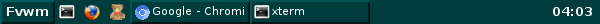
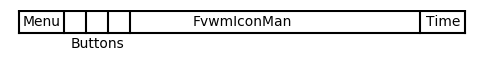
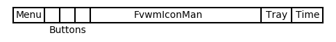

# FvwmTaskBar

* TOC
{:toc}

FvwmTaskBar is similar to the classic windows taskbar along the
bottom of the screen. In older versions of fvwm there was a module
FvwmTaskBar, but this was removed in 2.6.7 in favor of using
[FvwmButtons]({{ "/Modules/FvwmButtons" | prepend: site.wikiurl }})
and [FvwmIconMan]({{ "/Modules/FvwmIconMan" | prepend: site.wikiurl }}),
for a more configurable panel. 

Here is an example FvwmTaskBar panel created using FvwmButtons and
FvwmIconMan. The example below is configured to a width of 1200 pixels
and is not dynamic. You will have to adjust the size of both the full
FvwmTaskBar and the button that contains FvwmIconMan to fit your setup.

||

## Main Example

First set up the layout of FvwmButtons so it can be used to
compute the sizes of the different Buttons. FvwmTaskBar will
need a button for a Menu on the left end, three quick-launch
buttons, FvwmIconMan to list the running applications and a
final button to display the time.

Next determine the button size. The buttons should have a fixed
height and span the width of the screen. For the height of the
buttons I chose 24px and the width of my screen is 1200px.

The buttons are all in a single row, so only 1 Row is needed.
On the other hand the columns are of different widths. To give
the most fine grain control, use 1200 columns (the width of
the screen) so each button is 1 pixel and then specify the
actual Button width in the config file.

After some playing around I went with a width of 55px for the Menu
and Time and 25px for each of the three icons. The amount of space
left for FvwmIconMan is then 1200 - 55\*2 - 25\*3 = 1015 pixels.

Once the sizes are figured out, use them to build the buttons
starting at the left end.


DestroyModuleConfig FvwmTaskBar: *
*FvwmTaskBar: Geometry 1200x24+0-0
*FvwmTaskBar: Colorset 15
*FvwmTaskBar: Frame 0
*FvwmTaskBar: Font "xft:Sans:size=10:bold:antialias=True"
*FvwmTaskBar: Rows 1
*FvwmTaskBar: Columns 1200

# Menu Button
*FvwmTaskBar: (55x1, Title "Fvwm", ActiveColorset 16, Action(Mouse 1) \
               Menu MenuFvwmRoot Root 0 o100-24p, Frame 2)

# Quick Launch Buttons
*FvwmTaskBar: (25x1, Icon "icons/mini/xterm.png", ActiveColorset 16, \
               Action(Mouse 1) "Exec exec xterm")
*FvwmTaskBar: (25x1, Icon "icons/mini/firefox.png", ActiveColorset 16, \
               Action(Mouse 1) "Exec exec gimp")
*FvwmTaskBar: (25x1, Icon "icons/mini/xteddy.png", ActiveColorset 16, \
               Action(Mouse 1) "Exec exec xteddy")

# Swallow FvwmIconMan TaskBarIcons
*FvwmTaskBar: (1015x1, Left, Swallow TaskBarIcons 'Module FvwmIconMan \
               TaskBarIcons')

# Time Button with id TaskTime
*FvwmTaskBar: (55x1, id "TaskTime", ActiveColorset 16, Title "Time")


These buttons will span the whole screen and be placed along the bottom.

+ The Menu button opens the menu named MenuFvwmRoot, located 24px
  from the bottom of the screen.
+ The quick-launch buttons run xterm, firefox and xteddy with an Icon
  for each. Icons need to be located in the [ImagePath](
  {{ "/Config/ImagePath" | prepend: site.wikiurl }}).
+ The Time button is given the id TaskTime and a placeholder Title
  "Time". Setting the id for this Button allows one to change the
  Title to the current time by using SendToModule (see below).
+ FvwmIconMan TaskBarIcons is Swallowed into the task but but
  still needs to be configured.

### FvwmIconMan Configuration

The configuration of [FvwmIconMan](
{{ "/Modules/FvwmIconMan" | prepend: site.wikiurl }}) needs to set
a fixed size, configure the look of different button types, and
configure what happens when when a button is clicked.


DestroyModuleConfig TaskBarIcons: *
*TaskBarIcons: IconName TaskBarIcons
*TaskBarIcons: UseWinList true
*TaskBarIcons: Resolution global
*TaskBarIcons: Tips needed
*TaskBarIcons: Font "xft:Sans:size=8:antialias=True"

# Manager Size
*TaskBarIcons: ButtonGeometry 120x24
*TaskBarIcons: MaxButtonWidth 120
*TaskBarIcons: ManagerGeometry 1x1

# Button Styles
*TaskBarIcons: DrawIcons always
*TaskBarIcons: ReliefThickness 2
*TaskBarIcons: Format "%t"
*TaskBarIcons: IconButton down
*TaskBarIcons: IconAndSelectButton down
*TaskBarIcons: SelectButton up
*TaskBarIcons: Background #003c3c
*TaskBarIcons: Foreground #ffffff
*TaskBarIcons: PlainColorset 15
*TaskBarIcons: FocusColorset 16
*TaskBarIcons: FocusAndSelectColorset 16
*TaskBarIcons: SelectColorset 16
*TaskBarIcons: IconAndSelectColorset 16

# Button Actions
*TaskBarIcons: Action Mouse 1 A sendcommand IconManClick
*TaskBarIcons: Action Mouse 2 A sendcommand Nop
*TaskBarIcons: Action Mouse 3 A sendcommand "Menu MenuIconOps Mouse 0 o100"


+ FvwmIconMan will list all windows that aren't on the WindowListSkip.
  Changing rthe Resolution to screen, page, or desk will limit the
  list to the current screen, page or desk.
+ The ButtonSize has a maximum size of 120x24 pixels. And the
  ManagerSize is a fixed size of 1x1. The first 1 needs to be
  non-zero but it is ignored, as FvwmIconMan is resized when
  it is Swallowed to the size of the button. The second number
  needs to be a 1 and configures a single row of icons.
+ The Button Styles set the 3D look of the buttons and different
  looks for Focused Window, Selected Button (one the mouse is over),
  and Icon Buttons (for Iconified windows).

  Due to a bug in 2.6.7, when FvwmIconMan is a fixed size it won't
  draw the background correctly if using a default Colorset. Setting
  the colors with Background and Foreground works.

+ The mouse is then configured to run the function [IconManClick](
{{ "/Modules/FvwmIconMan/#button-actions" | prepend: site.wikiurl }})
  which either brings the window into view, or if it is in view the
  window is iconified.

  On a right click it opens the menu [MenuIconOps](
{{ "/Menus/WindowOps" | prepend: site.wikiurl }}) which can be used 
  to preform different actions on the selected window.

### Additional Styles

Last, set up some Styles for the panel such as no Title,
no Borders, is on the WindowListSkip, StaysOnTop.
Define the Colorsets and set up the Periodic task to update
the time.


# FvwmTaskBar styles
Style FvwmTaskBar !Borders, !Title, WindowListSkip, \
                  StaysOnTop, Sticky

# Set EwmhBaseStruts left right top bottom
EwmhBaseStruts 0 0 0 24

# Colorsets
Colorset 15 fg #ffffff, bg #003c3c, hi #005c5c, sh #001c1c
Colorset 16 fg #2d2d2d, bg #ffffff, hi #005c5c, sh #001c1c

# Run FvwmTaskBar
Module FvwmIconMan FvwmTaskBar

# Set the time to the current time
PipeRead 'echo "SendToModule FvwmButtons ChangeButton \
TaskTime Title \"`date +%R`\""'

# Schedule the time to update every 10 seconds
Schedule Periodic 10000 PipeRead 'echo "SendToModule \
FvwmButtons ChangeButton TaskTime Title \"`date +%R`\""'


To load the FvwmTaskBar when fvwm loads add the Module
command and Schedule command to your [StartFunction](
{{ "/Config/StartFunction" | prepend: site.wikiurl }}).

## Stalonetray Example

Another feature of a taskbar is the systemtray. A systemtray is a place
some applications put an icon to interact with it. Fvwm does not have
a built in systemtray. If a system tray is needed one solution is to
use the stand-alone systemtray [stalonetray](
https://stalonetray.sourceforge.net/).

This tray can be swallowed inside of FvwmButtons and added to the taskbar.

To add this first configure the size of the stalonetray. I have had the
best luck by making stalonetray a fixed size, which matches the size
of the button that will swallow it. To do this first determine the iconsize
and then the max number of icons needed.

In order to configure stalonetray you will either need to write a
$HOME/.stalonetrayrc file or configure it with a list of command line
flags. Here is a copy the $HOME/.stalonetrayrc file used

    decorations none
    geometry 6x1
    icon_size 20
    kludges force_icons_size
    max_geometry 6x1
    parent_bg true
    icon_gravity SE
    no_shrink true

For this example I chose an icon_size of 20 and will show at most 6 icons
giving a width of 6*20 = 120 pixels. The no_shrink setting makes
stalonetray not grow/srhink. For a full list of the options see the
stalonetray manpage.

Now that stalonetray is configured and the width of the button is calculated,
update the FvwmTaskBar configuration to add this new button as follows.


DestroyModuleConfig FvwmTaskBar: *
*FvwmTaskBar: Geometry 1200x24+0-0
*FvwmTaskBar: Colorset 15
*FvwmTaskBar: Frame 0
*FvwmTaskBar: Font "xft:Sans:size=10:bold:antialias=True"
*FvwmTaskBar: Rows 1
*FvwmTaskBar: Columns 1200

*FvwmTaskBar: (55x1, Title "Fvwm", ActiveColorset 16, Action(Mouse 1) \
               Menu MenuFvwmRoot Root 0 o100-24p, Frame 2)
*FvwmTaskBar: (25x1, Icon "icons/mini/xterm.png", ActiveColorset 16, \
               Action(Mouse 1) "Exec exec xterm")
*FvwmTaskBar: (25x1, Icon "icons/mini/firefox.png", ActiveColorset 16, \
               Action(Mouse 1) "Exec exec gimp")
*FvwmTaskBar: (25x1, Icon "icons/mini/xteddy.png", ActiveColorset 16, \
               Action(Mouse 1) "Exec exec xteddy")
*FvwmTaskBar: (895x1, Left, Swallow TaskBarIcons 'Module FvwmIconMan \
               TaskBarIcons')
*FvwmTaskBar: (120x1, Swallow(NoClose, UseOld) stalonetray \
               'Exec exec stalonetray', Frame 0)
*FvwmTaskBar: (55x1, id "TaskTime", ActiveColorset 16, Title "Time")


