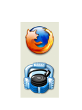

# HoverButton

HoverButton tries to achieve the effect that is seen in some panels
where then the mouse is over the Button, the button hovers above
the panel leaving a shadow, such as the examples shown below.

The middle image is the panel, and the right and left panels show
what happens when the mouse is hovering over the corresponding
icon.

|  |

Each Button consists of two instances of FvwmButtons. One is the image
that is seen as a dock and the other is the icon that hovers above
that is Iconified.

FvwmEvent is then used to change the icon of the dock to a shadow with
SendToModule, and Iconify the other button bringing it into view.
This is all achieved through the following collection of functions:


################
# 
# HoverButton Functions. These collection of functions create
# single icon buttons that cause the button to hover when active.
#
# Put these functions in your config file then create the buttons with
#
# CreateDock '$0' '$1' '$2' '$3' '$4' '$5' '$6' '$7' '$8' '$9'
#   $0 -> ButtonId
#   $1 -> Geometry
#   $2 -> Icon
#   #3 -> HoverGeometry
#   $4 -> HoverIcon
#   $5 -> action for Mouse 1
#   $6 -> action for Mouse 2
#   $7 -> action for Mouse 3
#
###################################
DestroyFunc LaunchDock
AddToFunc LaunchDock I Module FvwmEvent FE-Dock
DestroyFunc RestoreDock
AddToFunc RestoreDock I All (FvwmDockA*) Iconify On
DestroyFunc CreateDock
AddToFunc CreateDock
+ I InfoStoreAdd dock$0-icon "$2"
+ I DestroyModuleConfig FvwmDock-$0: *
+ I *FvwmDock-$0: Geometry $1
+ I *FvwmDock-$0: Font none
+ I *FvwmDock-$0: Colorset 10
+ I *FvwmDock-$0: Frame 0
+ I *FvwmDock-$0: Padding 0 0
+ I *FvwmDock-$0: (Id D$0, Icon $2)
+ I CreateActiveButton $0 $3 "$4" "$5" "$6" "$7"
+ I AddToFunc LaunchDock I Module FvwmButtons FvwmDock-$0
+ I AddToFunc LaunchDock I Module FvwmButtons FvwmDockA$0
+ I AddToFunc RestoreDock I \
  SendToModule FvwmDock-$0 ChangeButton D$0 Icon "$2"

DestroyFunc CreateActiveButton
AddToFunc CreateActiveButton
+ I DestroyModuleConfig FvwmDockA$0: *
+ I *FvwmDockA$0: Pixmap none
+ I *FvwmDockA$0: BoxSize fixed
+ I *FvwmDockA$0: Frame 0
+ I *FvwmDockA$0: Font none
+ I *FvwmDockA$0: Padding 0 0
+ I *FvwmDockA$0: Rows 1
+ I *FvwmDockA$0: Columns 1
+ I *FvwmDockA$0: Geometry $1
+ I *FvwmDockA$0: (Icon $2, Action(Mouse 1) '$3', \
     Action(Mouse 2) '$4', Action(Mouse 3) '$5')

DestroyFunc EventHandler
AddToFunc EventHandler
+ I None (Focused, FvwmDock*) Schedule 500 35 RestoreDock
+ I TestRc (Match) Break
+ I Current (FvwmDock*) PipeRead 'echo InfoStoreAdd \
    cur_dock $[w.name] | sed -r "s/FvwmDock[\-A]//"'
+ I KeepRc TestRc (NoMatch) RestoreDock
+ I TestRc (NoMatch) Break
+ I Deschedule 35
+ I ThisWindow (FvwmDockA*) Break
+ I RestoreDock
+ I SendToModule FvwmDock-$[infostore.cur_dock] ChangeButton \
    D$[infostore.cur_dock] Icon "shadow.png"
+ I All (FvwmDockA$[infostore.cur_dock], Iconic) Iconify Off

DestroyFunc KillDock
AddToFunc KillDock
+ I KillModule FvwmButtons FvwmDock*
+ I KillModule FvwmEvent FE-Dock

# FvwmEvent Config
DestroyModuleConfig FE-Dock: *
*FE-Dock: focus_change EventHandler


Once we have the functions defined, we can use them to build our dock. In this case
I am going to recreate [SimpleButtons]({{ "/Panels/SimpleButtons" | prepend: site.wikiurl }}),
but using the HoverButton Functions. Using the same calculations I will put the first button
at 60x60+780-50 and then move each button 70 pixels to the right.


CreateDock '11' '60x60+780-50' '48x48/xterm.png' '80x80+760-80' '64x64/xterm.png' 'Exec exec xterm' 'Nop' 'Nop'
CreateDock '12' '60x60+840-50' '48x48/firefox.png' '80x80+820-80' '64x64/firefox.png' 'Exec exec xterm' 'Nop' 'Nop'
CreateDock '13' '60x60+900-50' '48x48/gimp.png' '80x80+880-80' '64x64/gimp.png' 'Exec exec xterm' 'Nop' 'Nop'
CreateDock '14' '60x60+960-50' '48x48/gvim.png' '80x80+940-80' '64x64/gvim.png' 'Exec exec xterm' 'Nop' 'Nop'
CreateDock '15' '60x60+1020-50' '48x48/vlc.png' '80x80+1000-80' '64x64/vlc.png' 'Exec exec xterm' 'Nop' 'Nop'
CreateDock '16' '60x60+1080-50' '48x48/editor.png' '80x80+1060-80' '64x64/editor.png' 'Exec exec xterm' 'Nop' 'Nop'


Now I need to Set the styles for these Docks that get created
and run use the LaunchDock to run the Modules to load the Dock.


Style FvwmDock* Sticky, !Title, !Borders, WindowListSkip, MouseFocus
Style FvwmDock-* StaysOnBottom, FixedPosition, FixedSize
Style FvwmDockA* StaysOnTop, FixedSize, StartIconic

LaunchDock


To get these to load when fvwm runs, add the LaunchDock function to your
[StartFunction]({{ "/Config/StartFunction" | prepend: site.wikiurl }}).
