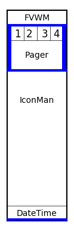

* TOC
{:toc}

# RightPanel

The RightPanel is a taskbar like panel along the right edge of the screen
for a now more common widescreen setup. This panel contains [FvwmPager](
{{ "/Moduels/FvwmPager" | prepend: site.wikibaseurl }}) for moving around
the virtual desktops, [FvwmIconMan](
{{ "/Modules/FvwmIconMan" | prepend: site.wikibaseurl }}) to list the running
applications and then uses [FvwmScript-DateTime](
{{ "/Modules/FvwmScript" | prepend: site.wikibaseurl }}) to display and update
the time and date.

## FvwmButtons Configuration

For this example I will show a simplified version of the configuration
found in the default config. For a widescreen with a resolution of 1280x720
the height of the panel needs to be 720 and the width will be 120.

The layout of the buttons is as show, where the thick blue lines
represent buttons used for padding:

Use the layout to determine the size of each button and then put
it together into a config, for example:


DestroyModuleConfig RightPanel:*
*RightPanel: Geometry 120x720-0+0
*RightPanel: Colorset 10
*RightPanel: Rows 720
*RightPanel: Columns 120
*RightPanel: Frame 0
*RightPanel: Font "xft:Sans:Bold:size=10:antialias=True"
*RightPanel: (120x45, Icon "fvwm-logo-small.png", Frame 0)
*RightPanel: (120x5, Frame 0)
*RightPanel: (10x20, Frame 0)
*RightPanel: (25x20, Id desk0, Title "0", Action (Mouse 1) GotoDesk 0 0, \
              Colorset 11, ActiveColorset 12, Frame 0)
*RightPanel: (25x20, Id desk1, Title "1", Action (Mouse 1) GotoDesk 0 1, \
              ActiveColorset 12, Frame 0)
*RightPanel: (25x20, Id desk2, Title "2", Action (Mouse 1) GotoDesk 0 2, \
              ActiveColorset 12, Frame 0)
*RightPanel: (25x20, Id desk3, Title "3", Action (Mouse 1) GotoDesk 0 3, \
              ActiveColorset 12, Frame 0)
*RightPanel: (10x20, Frame 0)
*RightPanel: (5x80, Frame 0)
*RightPanel: (110x80, Swallow FvwmPager 'Module FvwmPager *', Frame 0)
*RightPanel: (5x80, Frame 0)
*RightPanel: (120x5, Frame 0)
*RightPanel: (120x515, Top, Swallow FvwmIconMan 'Module FvwmIconMan', Frame 0)
*RightPanel: (120x45, Swallow DateTime 'Module FvwmScript \
              FvwmScript-DateTime', Frame 0)
*RightPanel: (120x5, Frame 0)


The buttons right above the Pager are used to switch between the first
four Desktops and are setup so the current Desktop is a different color.

To do this we need to use FvwmEvent and SendToModule to change the colorsets
of the deskN Buttons each time the desktop is changed.


DestroyFunc ChangeDesk
AddToFunc   ChangeDesk
+ I SendToModule FvwmButtons ChangeButton desk0 Colorset 10
+ I SendToModule FvwmButtons ChangeButton desk1 Colorset 10
+ I SendToModule FvwmButtons ChangeButton desk2 Colorset 10
+ I SendToModule FvwmButtons ChangeButton desk3 Colorset 10
+ I SendToModule FvwmButtons ChangeButton desk$0 Colorset 11

DestroyModuleConfig EventNewDesk:*
*EventNewDesk: PassID
*EventNewDesk: new_desk ChangeDesk


To run SensorDock add both the FvwmButtons and FvwmEvent modules
to the [StartFunction]({{ "/Config/StartFunction" | prepend: site.wikibaseurl }}):


AddToFunc StartFunction I Module FvwmButtons SensorDock
AddToFunc StartFunction I Module FvwmEvent EventNewDesk


## FvwmPager Configuration

The FvwmPager will be resized to fit the button so mostly need to configure
looks:


DestroyModuleConfig FvwmPager:*
*FvwmPager: Colorset * 10
*FvwmPager: HilightColorset * 13
*FvwmPager: BalloonColorset * 10
*FvwmPager: WindowColorsets 10 11
*FvwmPager: Font None
*FvwmPager: Balloons All
*FvwmPager: BalloonFont "xft:Sans:Bold:size=8:antialias=True"
*FvwmPager: BallonYOffset +2
*FvwmPager: Window3dBorders
*FvwmPager: MiniIcons


## FvwmIconMan Configuration

FvwmIconMan is configured to list all the running apps


DestroyModuleConfig FvwmIconMan:*
*FvwmIconMan: UseWinList true
*FvwmIconMan: ButtonGeometry 120x20
*FvwmIconMan: Colorset 10
*FvwmIconMan: FocusColorset 11
*FvwmIconMan: FocusAndSelectColorset 12
*FvwmIconMan: SelectColorset 12
*FvwmIconMan: IconAndSelectColorset 12
*FvwmIconMan: DrawIcons always
*FvwmIconMan: ReliefThickness 0
*FvwmIconMan: Format "%t"
*FvwmIconMan: Font "xft:Sans:Bold:size=8:antialias=True"
*FvwmIconMan: Action Mouse 1 A sendcommand IconManClick
*FvwmIconMan: Action Mouse 2 A sendcommand Nop
*FvwmIconMan: Action Mouse 3 A sendcommand "Menu MenuIconOps"
*FvwmIconMan: Resolution global
*FvwmIconMan: Tips needed
*FvwmIconMan: Sort id


This configuration requires the function [IconManClick](
{{ "/Modules/FvwmIconMan/#button-actions" | prepend: site.wikibaseurl }})
and the menu [MenuIconOps](
{{ "/Menus/WindowOps" | prepend: site.wikibaseurl }}).

Note: FvwmIconMan is set to grow. One problem with this is FvwmIconMan
will grow bigger than the Button that is put in. If you have troubles
with this due to the size and number of windows you can change the
Resolution to desk or page to limit the number of windows shown.

Or better yet, configure [FvwmIconMan](
{{ "/Modules/FvwmIconMan/#manager-size" | prepend: site.wikibaseurl }})
to be a fixed size. 

## Dynamic Configuration

The actual RightPanel in the default config is configured to be dynamic
and stretch to the height of the screen. It is also configured to use
stalonetray if it is installed. Since Fvwm can't do math directly any
calculations need to be in a shell using PipeRead and Test is used
to determine if stalonetray exists.

As an example of a dynamic configuration here is the RightPanel from
the default-config:


DestroyModuleConfig RightPanel:*
*RightPanel: Geometry 120x$[vp.height]-0+0
*RightPanel: Colorset 10
*RightPanel: Rows $[vp.height]
*RightPanel: Columns 120
*RightPanel: Frame 0
*RightPanel: Font "xft:Sans:Bold:size=10:antialias=True"
*RightPanel: (120x45, Icon "fvwm-logo-small.png", Frame 0)
*RightPanel: (120x5, Frame 0)
*RightPanel: (10x20, Frame 0)
*RightPanel: (25x20, Id desk0, Title "0", Action (Mouse 1) GotoDesk 0 0, \
              Colorset 11, ActiveColorset 12, Frame 0)
*RightPanel: (25x20, Id desk1, Title "1", Action (Mouse 1) GotoDesk 0 1, \
              ActiveColorset 12, Frame 0)
*RightPanel: (25x20, Id desk2, Title "2", Action (Mouse 1) GotoDesk 0 2, \
              ActiveColorset 12, Frame 0)
*RightPanel: (25x20, Id desk3, Title "3", Action (Mouse 1) GotoDesk 0 3, \
              ActiveColorset 12, Frame 0)
*RightPanel: (10x20, Frame 0)
*RightPanel: (5x80, Frame 0)
*RightPanel: (110x80, Swallow FvwmPager 'Module FvwmPager *', Frame 0)
*RightPanel: (5x80, Frame 0)
*RightPanel: (120x5, Frame 0)
Test (x stalonetray) *RightPanel: (120x20, Swallow(NoClose,UseOld) \
    stalonetray 'Exec exec stalonetray --config \
    "$[FVWM_DATADIR]/default-config/.stalonetrayrc"', Frame 0)
Test (x stalonetray) PipeRead 'echo "*RightPanel: (120x$(($[vp.height]-225)),\
    Top, Swallow FvwmIconMan \'Module FvwmIconMan\', Frame 0)"'
Test (!x stalonetray) PipeRead 'echo "*RightPanel: (120x$(($[vp.height]-205)),\
    Top, Swallow FvwmIconMan \'Module FvwmIconMan\', Frame 0)"'
*RightPanel: (120x45, Swallow DateTime 'Module FvwmScript \
              FvwmScript-DateTime', Frame 0)
*RightPanel: (120x5, Frame 0)

