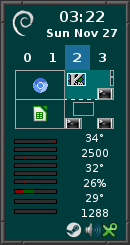

# SensorDock

* TOC
{:toc}

SensorDock is a dock which uses [FvwmButtons](
{{ "/Modules/FvwmButtons" | prepend: site.wikiurl }}) to Swallow
different apps such as [FvwmPager](
{{ "/Modules/FvwmPager" | prepend: site.wikiurl }}), xosview,
stalonetray, and some system output using FvwmScript.

Here is a screenshot of the Dock, which I put in the upper right corner
of my screen, slightly offset from the edge.

||

## FvwmButtons Configuration

The dock is built using FvwmButtons. The size is 120x235 and
I split it up into columns and rows so that each buttons are
5x5 pixels.

From there I define the buttons, Swallowing the various apps
to build the Dock.


DestroyModuleConfig SensorDock: *
*SensorDock: Geometry 120x235-5+5
*SensorDock: Colorset 10
*SensorDock: Rows 47
*SensorDock: Columns 24
*SensorDock: Font "xft:Sans:Bold:size=10:antialias=True"
*SensorDock: Frame 0
*SensorDock: (7x7, Icon "icons/debian.svg:28x28", Frame 0)
*SensorDock: (17x7, Swallow DateTime 'Module FvwmScript $[FVWM_USERDIR]/scripts/DateTime', Frame 0)
*SensorDock: (24x1, Frame 0)
*SensorDock: (2x5, Frame 0)
*SensorDock: (5x5, Id desk0, Title "0", Action (Mouse 1) GotoDesk 0 0, Colorset 11, ActiveColorset 12, Frame 0)
*SensorDock: (5x5, Id desk1, Title "1", Action (Mouse 1) GotoDesk 0 1, Colorset 10, ActiveColorset 12, Frame 0)
*SensorDock: (5x5, Id desk2, Title "2", Action (Mouse 1) GotoDesk 0 2, Colorset 10, ActiveColorset 12, Frame 0)
*SensorDock: (5x5, Id desk3, Title "3", Action (Mouse 1) GotoDesk 0 3, Colorset 10, ActiveColorset 12, Frame 0)
*SensorDock: (2x5, Frame 0)
*SensorDock: (2x12, Frame 0)
*SensorDock: (20x12, Swallow FvwmPager 'Module FvwmPager *', Frame 0)
*SensorDock: (2x12, Frame 0)
*SensorDock: (12x1, Frame 0)
*SensorDock: (12x18, Swallow Sensors 'Module FvwmScript $[FVWM_USERDIR]/scripts/Sensors', Frame 2)
*SensorDock: (1x16, Frame 0)
*SensorDock: (10x10, Swallow(UseOld) "cpumon" `Exec exec xosview -title cpumon +cpu`, Frame 0)
*SensorDock: (1x16, Frame 0)
*SensorDock: (10x2, Swallow(UseOld) "memmon" `Exec exec xosview -title memmon +mem`, Frame 0)
*SensorDock: (10x2, Swallow(UseOld) "netmon" `Exec exec xosview -title netmon +net`, Frame 0)
*SensorDock: (10x2, Swallow(UseOld) "hdmon" `Exec exec xosview -title hdmon +disk`, Frame 0)
*SensorDock: (2x4, Frame 0)
*SensorDock: (20x4, Swallow(NoClose,UseOld) "stalonetray" 'Exec exec stalonetray', Frame 0)
*SensorDock: (2x4, Frame 0)


The buttons right above the Pager are used to switch between the first
four Desktops and are setup so the current Desktop is a different color.

To do this we need to use FvwmEvent and SendToModule to change the colorsets
of the deskN Buttons each time the desktop is changed.


DestroyFunc ChangeDesk
AddToFunc   ChangeDesk
+ I SendToModule FvwmButtons ChangeButton desk0 Colorset 10
+ I SendToModule FvwmButtons ChangeButton desk1 Colorset 10
+ I SendToModule FvwmButtons ChangeButton desk2 Colorset 10
+ I SendToModule FvwmButtons ChangeButton desk3 Colorset 10
+ I SendToModule FvwmButtons ChangeButton desk$0 Colorset 11

DestroyModuleConfig EventNewDesk:*
*EventNewDesk: PassID
*EventNewDesk: new_desk ChangeDesk


To run SensorDock add both the FvwmButtons and FvwmEvent modules
to the [StartFunction]({{ "/Config/StartFunction" | prepend: site.wikiurl }}):


AddToFunc StartFunction I Module FvwmButtons SensorDock
AddToFunc StartFunction I Module FvwmEvent EventNewDesk


Next all of the different apps that are used in the SensorDock need to be
configured.

## FvwmPager Configuration

FvwmPager will display a collection of Desktops. When run from
FvwmButtons, the pager is configured to only show the current
desktop. Since the pager will be resized to fit the button, only
the colorsets and visual options need to be configured:


DestroyModuleConfig FvwmPager:*
*FvwmPager: Colorset * 10
*FvwmPager: HilightColorset * 13
*FvwmPager: BalloonColorset * 10
*FvwmPager: WindowColorsets 10 11
*FvwmPager: Font None
*FvwmPager: Balloons All
*FvwmPager: BalloonFont "xft:Sans:Bold:size=8:antialias=True"
*FvwmPager: BallonYOffset +2
*FvwmPager: Window3dBorders
*FvwmPager: MiniIcons


## Xosview Configuration

[Xosview](https://www.pogo.org.uk/~mark/xosview) is a program
that can show various system stats in graphical bars. What I like
about xosivew is being able to turn off everything except the
graphical bar and when swallowed it becomes the size of the Button.

To do this requires configuring xosview via the $HOME/.Xdefaults file.
These configurations first turn off all the sensors and extra text
and then set the colors. When run from FvwmButtons, each bar is manually
selected via a command line flag.

Here is the configuration from my .Xdefaults file

    xosview*title: volticor
    xosview*captions: False
    xosview*labels: False
    xosview*usedlabels: False
    xosview*borderwidth: 0
    xosview*font: fixed
    xosview*foreground: black
    xosview*background: #003c3c
    xosview*cpuGraph: True
    xosview*memGraph: False
    xosview*netBandwidth: 150000
    xosview*netDecay: False
    xosview*netGraph: True
    xosview*diskGraph: True
    xosview*diskDecay: False
    xosview*diskUsedFormat: percent

    xosview*battery: False
    xosview*gfx: False
    xosview*net: False
    xosview*page: False
    xosview*disk: False
    xosview*interrupts: False
    xosview*load: False
    xosview*swap: False
    xosview*lmstemp: False
    xosview*cpu: False
    xosview*mem: False
    xosview*wireless: False

    xosview*cpuFreeColor: #2d2d2d
    xosview*cpuUserColor: #900000
    xosview*cpuFormat: all
    xosview*memFreeColor: #2d2d2d
    xosview*memUsedColor: #900000
    xosview*memCacheColor: #006000
    xosview*diskIdleColor: #2d2d2d
    xosview*diskWriteColor: #900000
    xosview*diskReadColor: #000090
    xosview*netBackground: #2d2d2d
    xosview*netInColor: #000090
    xosview*netOutColor: #900000
    xosview*batteryLeftColor: #900000
    xosview*batteryUsedColor: #2d2d2d
    xosview*batteryChargeColor: #006000
    xosview*batteryFullColor: #009000
    xosview*batteryLowColor: #a00000
    xosview*batteryCritColor: #f00000
    xosview*batteryNoneColor: #2d2d2d
    xosview*batteryPriority: 30

You may need to run `xrdb -load ~/.Xdefaults` after adding these options.

## FvwmScript Configuration

FvwmScript can be used to display different information (or even build
interactive tools). In this example it is used to get info from the system
and display it. It is then scheduled to update the info on a set time
interval.

I use two scripts, first is the script [DateTime](DateTime) which is
a slightly modified version of FvwmScript-DateTime from the default
config.

The second is a script [Sensors](Sensors), which uses the output of sensors
and nvidia-settings to display info about temperature and fan speeds.

The Sensors script will most likely not work on your system and you will
have to update it give the location of the outputs on your system. You
will also have to install and configure lm-sensors for this to work.

## stalonetray Configuration

The systemtray is [stalonetray](https://kolbusa.github.io/stalonetray/manpage.html)
and needs to be configured to work with FvwmButtons. This is the
$HOME/.stalonetrayrc file used for SensorDock

    decorations none
    geometry 6x1
    icon_size 18
    kludges force_icons_size
    max_geometry 6x1
    parent_bg true
    icon_gravity SE
    no_shrink true

